# Codyssey Week 1

## 1. 프로젝트 개요

터미널, Docker, Git/GitHub를 활용하여 재현 가능한 개발 워크스테이션을 구축하고, 실행 과정과 검증 결과를 문서화하는 미션입니다.

## 2. 실행 환경

- OS: macOS
- Architecture: Apple Silicon ARM64
- Shell: zsh
- Terminal: macOS Terminal
- Docker Client: 28.1.1
- Docker Context: desktop-linux
- Git: 2.51.0

## 3. 수행 체크리스트

- [ ] 터미널 기본 조작
- [ ] 파일 및 디렉토리 권한 실습
- [ ] Docker 실행 환경 점검
- [ ] hello-world 컨테이너 실행
- [ ] Ubuntu 컨테이너 실습
- [ ] Dockerfile 기반 커스텀 이미지 제작
- [ ] 포트 매핑 검증
- [ ] 바인드 마운트 검증
- [ ] Docker 볼륨 영속성 검증
- [ ] Git 및 GitHub 연동
- [ ] 트러블슈팅 2건 이상 작성

## 4. 터미널 기본 조작

터미널에서 디렉토리와 파일을 생성하고, 복사·이동·삭제하는 기본 명령어를 실습했습니다.

### 4.1 현재 위치와 파일 목록 확인

`pwd` 명령으로 현재 작업 중인 디렉토리의 절대 경로를 확인하고, `ls -la` 명령으로 숨김 파일을 포함한 전체 파일 목록을 확인했습니다.

```bash
pwd
ls -la
```

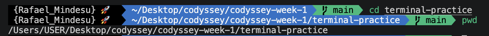

### 4.2 파일과 디렉토리 생성

`mkdir` 명령으로 `sample-dir` 디렉토리를 생성하고, `touch` 명령으로 `original.txt` 파일을 생성했습니다.

이후 출력 리다이렉션인 `>`를 사용하여 `original.txt` 파일에 `Hello Codyssey` 문자열을 작성했습니다.

```bash
mkdir sample-dir
touch original.txt
echo "Hello Codyssey" > original.txt
ls -la
cat original.txt
```

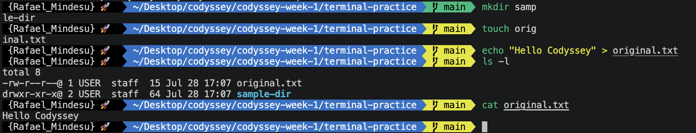

### 4.3 파일 복사

`cp` 명령을 사용하여 `original.txt` 파일을 `copied.txt`라는 이름으로 복사했습니다.

```bash
cp original.txt copied.txt
ls -la
```

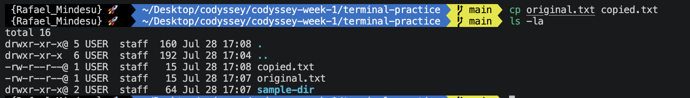

### 4.4 파일 이름 변경 및 이동

`mv` 명령을 사용하여 `copied.txt` 파일의 이름을 `renamed.txt`로 변경했습니다.

이후 같은 `mv` 명령을 사용해 `renamed.txt` 파일을 `sample-dir` 디렉토리로 이동했습니다.

```bash
mv copied.txt renamed.txt
mv renamed.txt sample-dir/
ls -la
ls -la sample-dir
```

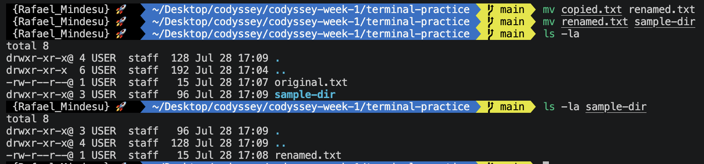

### 4.5 파일 내용 확인

`cat` 명령으로 `sample-dir` 디렉토리 안에 있는 `renamed.txt` 파일의 내용을 확인했습니다.

```bash
cat sample-dir/renamed.txt
```

```text
Hello Codyssey
```

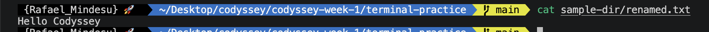

### 4.6 파일과 디렉토리 삭제

`rm` 명령으로 `sample-dir` 내부의 `renamed.txt` 파일을 삭제했습니다.

파일을 삭제한 뒤 비어 있는 `sample-dir` 디렉토리는 `rmdir` 명령으로 삭제했습니다.

```bash
rm sample-dir/renamed.txt
rmdir sample-dir
ls -la
```

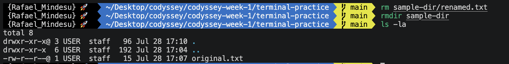

실습이 끝난 후에는 최초에 생성한 `original.txt` 파일만 남겨 두었습니다.

현재 터미널 실습 디렉토리의 구조는 다음과 같습니다.

```text
terminal-practice/
└── original.txt
```

### 4.7 절대 경로와 상대 경로

절대 경로는 루트 디렉토리부터 특정 파일이나 디렉토리까지의 전체 위치를 표현한 경로입니다.

현재 프로젝트의 `original.txt` 파일을 절대 경로로 표현하면 다음과 같은 형태가 됩니다.

```text
/Users/<username>/<workspace>/codyssey-week-1/terminal-practice/original.txt
```

사용자 이름과 프로젝트를 저장한 상위 디렉토리는 실행 환경에 따라 달라질 수 있습니다.

상대 경로는 현재 작업 중인 디렉토리를 기준으로 파일이나 디렉토리의 위치를 표현합니다.

현재 위치가 프로젝트 루트인 `codyssey-week-1`이라면 다음 상대 경로로 `original.txt` 파일을 표현할 수 있습니다.

```text
./terminal-practice/original.txt
```

현재 위치가 `terminal-practice`라면 다음과 같이 표현할 수 있습니다.

```text
./original.txt
```

`terminal-practice`에서 상위 디렉토리에 있는 `README.md`는 다음 상대 경로로 접근할 수 있습니다.

```text
../README.md
```

정리하면 다음과 같습니다.

| 표현 | 의미 |
|---|---|
| `/Users/.../original.txt` | 루트부터 시작하는 절대 경로 |
| `./original.txt` | 현재 디렉토리에 있는 파일 |
| `../README.md` | 현재 디렉토리의 상위 디렉토리에 있는 파일 |

### 4.8 프로젝트 디렉토리 구조

터미널 기본 조작 실습을 완료한 후의 프로젝트 구조는 다음과 같습니다.

```text
.
├── README.md
├── images
│   └── terminal-practice
│       ├── cd_pwd.png
│       ├── 파일과디렉토리삭제.png
│       ├── 파일과디렉토리생성.png
│       ├── 파일내용확인.png
│       ├── 파일복사.png
│       └── 파일이름변경및이동.png
└── terminal-practice
    └── original.txt
```

## 5. 파일 및 디렉토리 권한 실습

macOS는 Unix 기반 운영체제이므로 `ls`와 `chmod` 명령을 사용해 파일 및 디렉토리 권한을 확인하고 변경할 수 있습니다.

이번 실습에서는 파일의 실행 권한 유무를 비교하고, 파일과 디렉토리의 권한을 각각 변경했습니다.

### 5.1 권한 실습 환경 구성

권한 실습을 위해 `permission-practice` 디렉토리 아래에 `sample.sh` 파일과 `sample-dir` 디렉토리를 생성했습니다.

```bash
mkdir -p permission-practice/sample-dir
touch permission-practice/sample.sh
echo 'echo "Hello Permission"' > permission-practice/sample.sh

cd permission-practice
tree -a
```

```text
.
├── sample-dir
└── sample.sh
```

### 5.2 변경 전 권한 확인

`ls -l` 명령으로 파일 권한을 확인하고, `ls -ld` 명령으로 디렉토리 자체의 권한을 확인했습니다.

```bash
ls -l sample.sh
ls -ld sample-dir
```

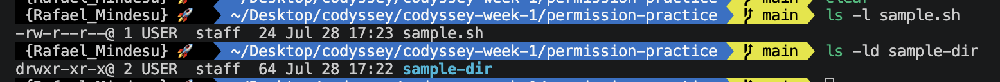

`ls -l`에 표시되는 권한은 다음과 같은 형태로 구성됩니다.

```text
-rw-r--r--
```

첫 번째 문자는 파일의 종류를 의미합니다.

| 문자 | 의미 |
|---|---|
| `-` | 일반 파일 |
| `d` | 디렉토리 |

이후의 아홉 문자는 세 자리씩 나뉘며 각각 소유자, 그룹, 기타 사용자의 권한을 나타냅니다.

```text
- | rw- | r-- | r--
    소유자  그룹  기타 사용자
```

macOS에서는 파일 권한 뒤에 `@`가 표시될 수 있습니다.

```text
-rw-r--r--@
```

`@`는 해당 파일에 macOS 확장 속성이 설정되어 있음을 의미하며, 기본적인 `r`, `w`, `x` 권한에는 영향을 주지 않습니다.

### 5.3 실행 권한이 없는 파일 실행

초기 상태의 `sample.sh` 파일에는 실행 권한인 `x`가 없었습니다.

실행 권한이 없는 상태에서 파일을 직접 실행했습니다.

```bash
./sample.sh
```

```text
zsh: permission denied: ./sample.sh
```

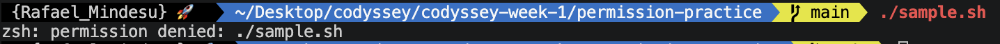

파일 내용은 존재하지만 실행 권한이 없으므로, 운영체제가 파일 실행을 허용하지 않았습니다.

### 5.4 파일 권한을 755로 변경

`chmod` 명령을 사용하여 `sample.sh` 파일의 권한을 `755`로 변경했습니다.

```bash
chmod 755 sample.sh
ls -l sample.sh
```

변경 후 권한은 다음과 같습니다.

```text
-rwxr-xr-x
```

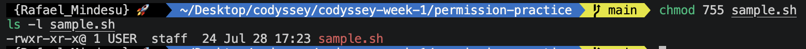

실행 권한이 추가된 뒤 파일을 다시 실행했습니다.

```bash
./sample.sh
```

```text
Hello Permission
```

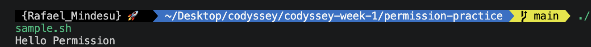

`755` 권한에서는 소유자뿐만 아니라 그룹과 기타 사용자도 파일을 실행할 수 있습니다.

### 5.5 파일 권한을 644로 변경

실행 권한 실습을 마친 뒤 `sample.sh` 파일의 권한을 일반적인 문서 파일 권한인 `644`로 변경했습니다.

```bash
chmod 644 sample.sh
ls -l sample.sh
```

```text
-rw-r--r--
```

`644` 권한에서는 소유자만 파일을 수정할 수 있고, 그룹과 기타 사용자는 파일을 읽을 수만 있습니다.

실행 권한인 `x`가 제거되었기 때문에 파일을 직접 실행할 수는 없습니다.

### 5.6 디렉토리 권한 변경

디렉토리 권한 변경을 확인하기 위해 `sample-dir`의 권한을 먼저 `700`으로 변경했습니다.

```bash
chmod 700 sample-dir
ls -ld sample-dir
```

```text
drwx------
```

`700` 권한에서는 디렉토리 소유자만 해당 디렉토리를 조회하고, 수정하고, 접근할 수 있습니다.

이후 디렉토리 권한을 일반적으로 사용되는 `755`로 다시 변경했습니다.

```bash
chmod 755 sample-dir
ls -ld sample-dir
```

```text
drwxr-xr-x
```

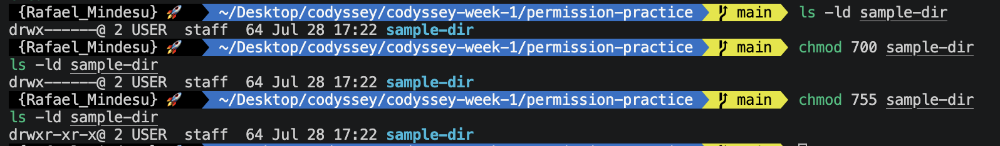

디렉토리에서 실행 권한인 `x`는 파일 실행이 아니라 해당 디렉토리 내부로 이동하거나 내부 항목에 접근할 수 있는 권한을 의미합니다.

### 5.7 `r`, `w`, `x` 권한의 의미

| 권한 | 숫자 | 파일에서의 의미 | 디렉토리에서의 의미 |
|---|---:|---|---|
| `r` | 4 | 파일 내용 읽기 | 디렉토리 내부 목록 확인 |
| `w` | 2 | 파일 내용 수정 | 파일 및 디렉토리 생성·삭제 |
| `x` | 1 | 파일 실행 | 디렉토리 내부 접근 및 이동 |

파일과 디렉토리는 같은 권한 기호를 사용하지만, 대상에 따라 권한의 의미가 달라집니다.

### 5.8 숫자 권한 표기 방식

숫자 권한은 `r`, `w`, `x`에 해당하는 숫자를 더하여 계산합니다.

```text
r = 4
w = 2
x = 1
```

각 숫자는 소유자, 그룹, 기타 사용자의 순서로 적용됩니다.

#### 755 권한

```text
7 = 4 + 2 + 1 = rwx
5 = 4 + 0 + 1 = r-x
5 = 4 + 0 + 1 = r-x
```

따라서 `755`는 다음 권한을 의미합니다.

```text
rwxr-xr-x
```

| 사용자 구분 | 권한 |
|---|---|
| 소유자 | 읽기, 쓰기, 실행 |
| 그룹 | 읽기, 실행 |
| 기타 사용자 | 읽기, 실행 |

#### 644 권한

```text
6 = 4 + 2 + 0 = rw-
4 = 4 + 0 + 0 = r--
4 = 4 + 0 + 0 = r--
```

따라서 `644`는 다음 권한을 의미합니다.

```text
rw-r--r--
```

| 사용자 구분 | 권한 |
|---|---|
| 소유자 | 읽기, 쓰기 |
| 그룹 | 읽기 |
| 기타 사용자 | 읽기 |

### 5.9 권한 실습 결과

파일에 실행 권한이 없을 때는 `permission denied` 오류가 발생했습니다.

이후 `chmod 755`를 적용해 실행 권한을 추가하자 `sample.sh` 파일이 정상적으로 실행되었습니다.

또한 파일에는 주로 `644`, 실행 파일이나 디렉토리에는 주로 `755` 권한이 사용되는 이유를 확인했습니다.

### 5.10 프로젝트 디렉토리 구조

권한 실습을 완료한 후 프로젝트 구조는 다음과 같습니다.

```text
.
├── README.md
├── images
│   ├── permission-practice
│   │   ├── 권한변경전.png
│   │   ├── 디렉토리권한변경.png
│   │   ├── 실행권한없음.png
│   │   ├── 파일권한변경1.png
│   │   └── 파일권한변경2.png
│   └── terminal-practice
│       ├── cd_pwd.png
│       ├── 파일과디렉토리삭제.png
│       ├── 파일과디렉토리생성.png
│       ├── 파일내용확인.png
│       ├── 파일복사.png
│       └── 파일이름변경및이동.png
├── permission-practice
│   ├── sample-dir
│   └── sample.sh
└── terminal-practice
    └── original.txt
```

## 6. Docker 설치 및 기본 점검

Docker Desktop을 이용해 macOS에서 Docker 컨테이너 실행 환경을 구성했습니다.

Docker CLI 설치 여부와 Docker 엔진의 동작 상태를 확인한 뒤, `hello-world` 컨테이너를 실행하여 이미지 다운로드부터 컨테이너 종료까지의 흐름을 확인했습니다.

### 6.1 Docker 실행 환경

이번 실습에서 사용한 Docker 환경은 다음과 같습니다.

| 항목 | 실행 환경 |
|---|---|
| 운영체제 | macOS |
| CPU 아키텍처 | Apple Silicon ARM64 |
| Docker 실행 환경 | Docker Desktop |
| Docker Client | 28.1.1 |
| Docker API | 1.49 |
| Docker Context | `desktop-linux` |
| Git | 2.51.0 |

### 6.2 Docker 버전 확인

`docker --version` 명령으로 Docker CLI의 설치 여부와 버전을 확인했습니다.

```bash
docker --version
```

```text
Docker version 28.1.1
```

Client와 Server의 상세 정보는 다음 명령으로 확인했습니다.

```bash
docker version
```

Docker Client 정보뿐만 아니라 Server 정보도 함께 출력되는 것을 통해 Docker CLI와 Docker 엔진이 정상적으로 연결되어 있음을 확인했습니다.

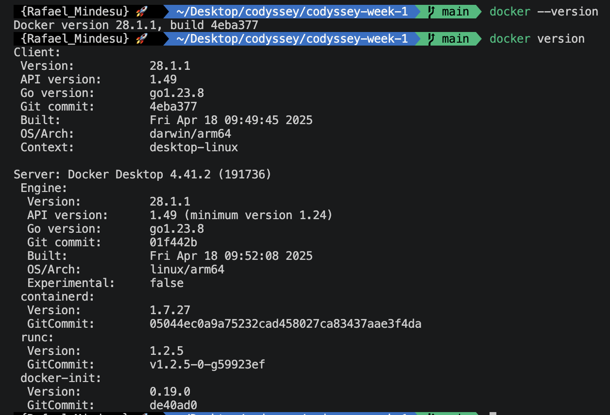

### 6.3 Docker 엔진 동작 확인

`docker info` 명령으로 Docker Context와 Docker 엔진의 실행 상태를 확인했습니다.

```bash
docker info
```

확인한 주요 항목은 다음과 같습니다.

- Docker Client 버전
- 현재 Docker Context
- Docker Server 버전
- 이미지 및 컨테이너 개수
- Docker Desktop 실행 환경
- Docker Compose 등 설치된 플러그인

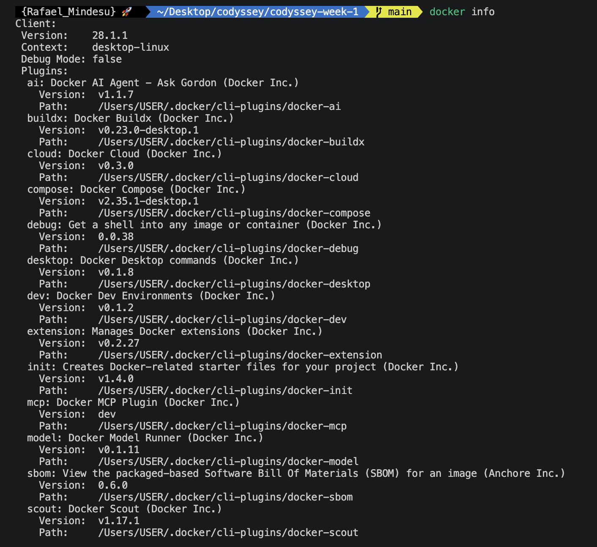

출력 결과에서 현재 Context가 `desktop-linux`로 설정되어 있었으며, Docker Server 정보가 정상적으로 출력되었습니다.

Docker Context는 다음 명령으로도 확인할 수 있습니다.

```bash
docker context ls
```

```text
NAME              DESCRIPTION                               DOCKER ENDPOINT
default           Current DOCKER_HOST based configuration
desktop-linux *   Docker Desktop
```

`*` 표시는 현재 사용 중인 Docker Context를 의미합니다.

### 6.4 Docker 데몬 연결 실패 트러블슈팅

#### 문제

최초로 `docker info` 명령을 실행했을 때 다음 오류가 발생했습니다.

```text
Cannot connect to the Docker daemon at unix:///Users/<username>/.docker/run/docker.sock.
Is the docker daemon running?
```

Docker 버전은 정상적으로 출력됐지만 Docker Server 정보는 확인할 수 없었습니다.

#### 원인 가설

Docker CLI는 설치되어 있었지만 실제 컨테이너를 관리하는 Docker 엔진이 실행되지 않은 것으로 판단했습니다.

현재 Docker Context는 `desktop-linux`였으므로 Docker Desktop의 엔진 상태를 확인했습니다.

#### 확인

다음 명령으로 Docker Context를 확인했습니다.

```bash
docker context ls
```

또한 macOS에서 Docker Desktop 애플리케이션의 실행 여부를 확인했습니다.

#### 해결

Docker Desktop을 실행하고 Docker 엔진이 완전히 시작될 때까지 기다린 뒤 `docker info`를 다시 실행했습니다.

```bash
docker info
```

#### 결과

Docker Server 정보가 정상적으로 출력되었으며, Docker CLI가 Docker 엔진과 정상적으로 연결된 것을 확인했습니다.

이번 문제를 통해 Docker CLI 설치와 Docker 엔진 실행은 서로 다른 상태라는 것을 확인했습니다.

### 6.5 `hello-world` 컨테이너 실행

Docker 컨테이너가 정상적으로 실행되는지 확인하기 위해 `hello-world` 이미지를 사용했습니다.

```bash
docker run --name hello-world-test hello-world
```

로컬 환경에 `hello-world` 이미지가 없었기 때문에 Docker가 이미지를 자동으로 다운로드한 뒤 컨테이너를 생성하고 실행했습니다.

```text
Hello from Docker!
```

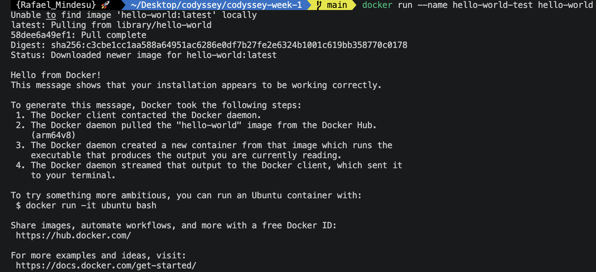

`hello-world` 컨테이너의 실행 과정은 다음과 같습니다.

1. 로컬에 `hello-world` 이미지가 있는지 확인합니다.
2. 이미지가 없으면 Docker Hub에서 다운로드합니다.
3. 다운로드한 이미지로 컨테이너를 생성합니다.
4. 컨테이너 내부 프로그램을 실행합니다.
5. `Hello from Docker!` 메시지를 출력합니다.
6. 작업 완료 후 컨테이너가 종료됩니다.

### 6.6 Docker 이미지 목록 확인

`docker images` 명령으로 로컬에 저장된 Docker 이미지 목록을 확인했습니다.

```bash
docker images
```

목록에서 `hello-world` 이미지가 다운로드된 것을 확인했습니다.

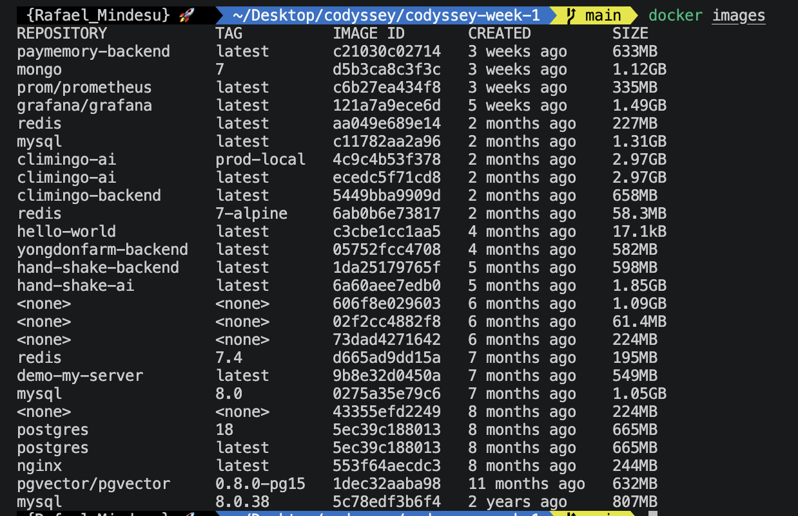

Docker 이미지는 컨테이너를 생성하기 위한 읽기 전용 템플릿입니다. 하나의 이미지로 여러 컨테이너를 생성할 수 있습니다.

### 6.7 컨테이너 목록 확인

현재 실행 중인 컨테이너를 확인했습니다.

```bash
docker ps
```

`hello-world` 컨테이너는 메시지를 출력한 뒤 바로 종료되므로 실행 중인 컨테이너 목록에는 표시되지 않았습니다.

종료된 컨테이너를 포함한 전체 컨테이너 목록은 `-a` 옵션으로 확인했습니다.

```bash
docker ps -a
```

`hello-world-test` 컨테이너가 다음과 같이 정상 종료된 상태로 표시되었습니다.

```text
Exited (0)
```

`Exited (0)`은 컨테이너 내부 프로세스가 오류 없이 정상적으로 종료됐다는 의미입니다.

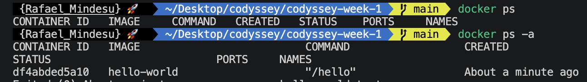

### 6.8 컨테이너 로그 확인

`docker logs` 명령으로 컨테이너가 실행될 때 출력한 로그를 다시 확인했습니다.

```bash
docker logs hello-world-test
```

```text
Hello from Docker!
```

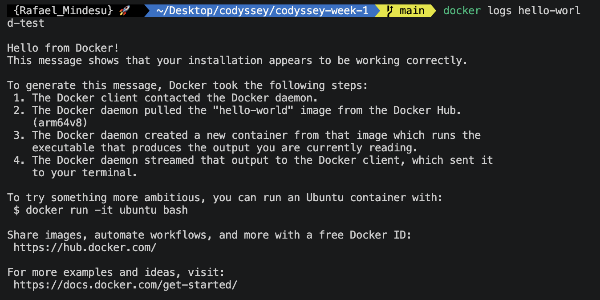

컨테이너가 종료된 이후에도 삭제하지 않았다면 실행 당시의 로그를 확인할 수 있습니다.

### 6.9 실행 중인 컨테이너 리소스 확인

`hello-world` 컨테이너는 바로 종료되기 때문에 별도의 Alpine 컨테이너를 백그라운드에서 실행했습니다.

```bash
docker run -d \
  --name stats-test \
  alpine \
  sleep 300
```

실행 중인 컨테이너를 확인했습니다.

```bash
docker ps
```

이후 `docker stats` 명령으로 컨테이너의 CPU 및 메모리 사용량을 확인했습니다.

```bash
docker stats --no-stream
```

`--no-stream` 옵션을 사용하면 리소스 사용량을 한 번만 출력한 뒤 명령이 종료됩니다.

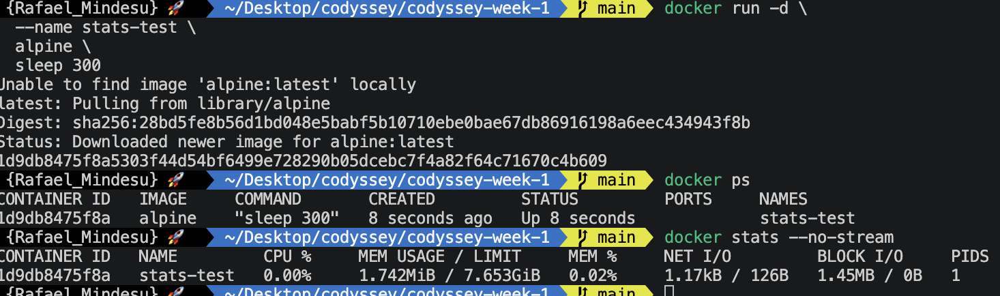

주요 확인 항목은 다음과 같습니다.

- CPU 사용률
- 메모리 사용량
- 네트워크 입출력
- 디스크 입출력
- 프로세스 개수

### 6.10 컨테이너 중지 및 삭제

실행 중인 `stats-test` 컨테이너를 중지했습니다.

```bash
docker stop stats-test
```

중지된 컨테이너를 포함한 전체 목록을 확인했습니다.

```bash
docker ps -a
```

실습을 마친 컨테이너를 삭제했습니다.

```bash
docker rm stats-test
docker rm hello-world-test
```

삭제 결과를 다시 확인했습니다.

```bash
docker ps -a
```

컨테이너를 삭제해도 컨테이너 생성에 사용한 Docker 이미지는 자동으로 삭제되지 않습니다.

이미지는 다음 명령으로 별도로 확인할 수 있습니다.

```bash
docker images
```

### 6.11 이미지와 컨테이너의 차이

Docker 이미지와 컨테이너는 다음과 같은 차이가 있습니다.

| 구분 | Docker 이미지 | Docker 컨테이너 |
|---|---|---|
| 역할 | 컨테이너 생성에 사용하는 템플릿 | 이미지를 기반으로 생성된 실행 환경 |
| 상태 | 읽기 전용 | 실행 중 변경 가능 |
| 관계 | 하나의 이미지로 여러 컨테이너 생성 가능 | 특정 이미지를 기반으로 생성 |
| 삭제 | 컨테이너와 별도로 관리 | 삭제해도 이미지는 유지됨 |

`hello-world` 이미지를 내려받은 뒤 `hello-world-test` 컨테이너를 생성하면서 이미지와 컨테이너가 분리되어 관리된다는 점을 확인했습니다.

### 6.12 Docker 기본 점검 결과

이번 실습을 통해 다음 내용을 확인했습니다.

- Docker CLI와 Docker 엔진은 서로 다른 구성 요소입니다.
- Docker Desktop이 실행되어야 Docker 엔진에 연결할 수 있습니다.
- 이미지가 로컬에 없으면 Docker Hub에서 자동으로 다운로드합니다.
- Docker 이미지를 기반으로 컨테이너가 생성됩니다.
- 컨테이너의 메인 프로세스가 끝나면 컨테이너도 종료됩니다.
- 종료된 컨테이너도 삭제 전까지 로그와 실행 상태를 확인할 수 있습니다.
- `docker stats`를 통해 실행 중인 컨테이너의 자원 사용량을 확인할 수 있습니다.

## 7. Ubuntu 컨테이너 실행 및 접속 방식 비교

Ubuntu 컨테이너를 대화형 모드와 백그라운드 모드로 실행하고, `docker exec`와 `docker attach`를 이용해 컨테이너에 접속했습니다.

각 접속 방식에서 `exit`가 컨테이너 상태에 어떤 영향을 주는지 직접 확인했습니다.

### 7.1 Ubuntu 이미지 다운로드

Ubuntu 24.04 이미지를 Docker Hub에서 다운로드했습니다.

```bash
docker pull ubuntu:24.04
```

다운로드한 이미지가 로컬에 저장되었는지 확인했습니다.

```bash
docker images
```

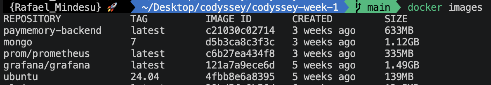

### 7.2 대화형 Ubuntu 컨테이너 실행

`-it` 옵션을 사용하여 Ubuntu 컨테이너를 실행하고 내부 Bash 셸에 접속했습니다.

```bash
docker run -it \
  --name ubuntu-interactive \
  ubuntu:24.04 \
  bash
```

옵션의 의미는 다음과 같습니다.

| 옵션 | 의미 |
|---|---|
| `-i` | 표준 입력을 유지 |
| `-t` | 가상 터미널을 할당 |
| `--name` | 컨테이너 이름 지정 |

명령 실행 후 터미널 프롬프트가 다음과 같이 변경되었습니다.

```text
root@<container-id>:/#
```

이는 현재 명령이 macOS가 아니라 Ubuntu 컨테이너 내부에서 실행되고 있다는 의미입니다.

### 7.3 컨테이너 내부 환경 확인

컨테이너 내부에서 현재 위치와 파일 목록, 운영체제 및 CPU 아키텍처를 확인했습니다.

```bash
pwd
ls -la
echo "Hello from Ubuntu container"
cat /etc/os-release
uname -m
```

주요 출력 결과는 다음과 같습니다.

```text
/
Hello from Ubuntu container
```

`cat /etc/os-release` 결과를 통해 컨테이너 내부 운영체제가 Ubuntu임을 확인했습니다.

Apple Silicon Mac에서 ARM64 기반 Ubuntu 이미지를 실행했기 때문에 `uname -m` 결과는 다음과 같이 출력되었습니다.

```text
aarch64
```

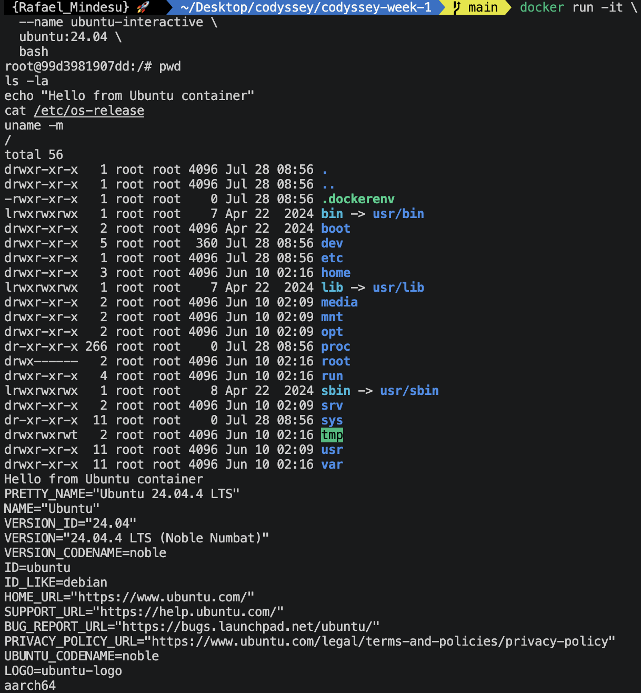

### 7.4 대화형 컨테이너 종료

컨테이너 내부에서 `exit`를 입력했습니다.

```bash
exit
```

macOS 터미널로 돌아온 뒤 컨테이너 상태를 확인했습니다.

```bash
docker ps
docker ps -a
```

`docker ps`에는 컨테이너가 표시되지 않았지만, `docker ps -a`에서는 `ubuntu-interactive` 컨테이너가 종료된 상태로 표시되었습니다.

```text
Exited (0)
```

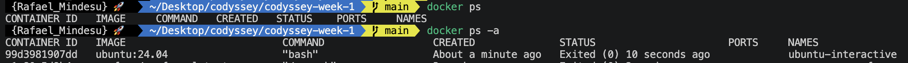

이번 컨테이너에서는 `bash`가 메인 프로세스였습니다. 따라서 Bash에서 `exit`를 입력하자 메인 프로세스가 종료되었고, 컨테이너도 함께 종료되었습니다.

### 7.5 종료된 컨테이너 다시 실행

종료된 컨테이너를 새로 생성하지 않고 다시 시작했습니다.

```bash
docker start -ai ubuntu-interactive
```

옵션의 의미는 다음과 같습니다.

| 옵션 | 의미 |
|---|---|
| `-a` | 컨테이너의 표준 출력에 연결 |
| `-i` | 표준 입력을 유지 |

컨테이너 내부에서 다음 명령을 실행해 정상적으로 재시작되었는지 확인했습니다.

```bash
echo "Container restarted"
```

이후 다시 `exit`를 입력하여 컨테이너를 종료했습니다.

```bash
exit
```

### 7.6 백그라운드 Ubuntu 컨테이너 실행

이번에는 Ubuntu 컨테이너를 백그라운드에서 실행했습니다.

```bash
docker run -dit \
  --name ubuntu-background \
  ubuntu:24.04 \
  bash
```

옵션의 의미는 다음과 같습니다.

| 옵션 | 의미 |
|---|---|
| `-d` | 컨테이너를 백그라운드에서 실행 |
| `-i` | 표준 입력을 유지 |
| `-t` | 가상 터미널을 할당 |

실행 중인 컨테이너를 확인했습니다.

```bash
docker ps
```

`ubuntu-background` 컨테이너가 `Up` 상태로 표시되는 것을 확인했습니다.

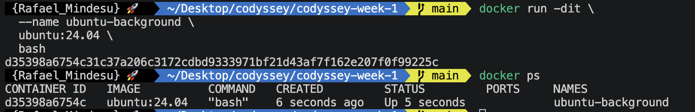

### 7.7 `docker exec`를 이용한 접속

`docker exec` 명령으로 실행 중인 컨테이너 내부에 새로운 Bash 프로세스를 실행했습니다.

```bash
docker exec -it ubuntu-background bash
```

컨테이너 내부에서 다음 명령을 실행했습니다.

```bash
echo "Connected with docker exec"
pwd
ls -la
```

이후 `exit`를 입력해 Bash에서 빠져나왔습니다.

```bash
exit
```

macOS 터미널에서 컨테이너 상태를 다시 확인했습니다.

```bash
docker ps
```

`docker exec`로 실행한 Bash에서는 `exit`를 입력했지만, `ubuntu-background` 컨테이너는 계속 `Up` 상태를 유지했습니다.

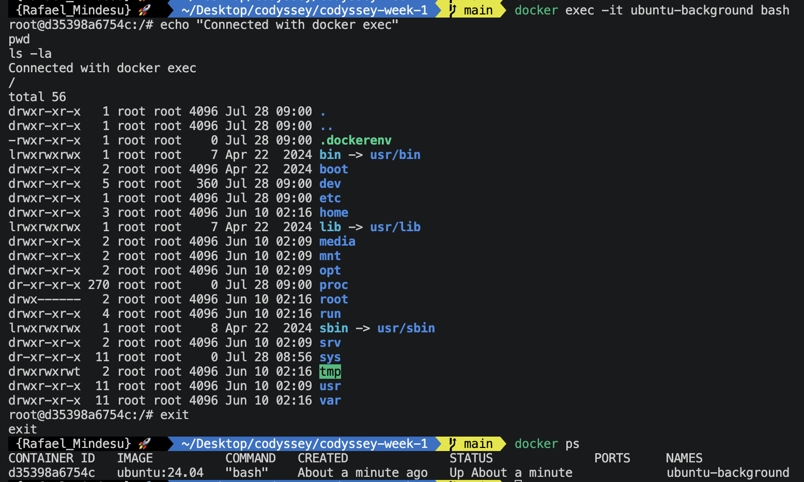

`docker exec`는 컨테이너의 메인 프로세스에 연결하는 것이 아니라, 컨테이너 내부에 별도의 프로세스를 추가로 실행합니다.

따라서 `docker exec`로 실행한 Bash가 종료되어도 컨테이너의 메인 프로세스는 계속 실행됩니다.

### 7.8 `docker attach`를 이용한 접속

`docker attach` 명령으로 실행 중인 컨테이너의 메인 프로세스에 직접 연결했습니다.

```bash
docker attach ubuntu-background
```

컨테이너 내부에서 다음 명령을 실행했습니다.

```bash
echo "Connected with docker attach"
```

```text
Connected with docker attach
```

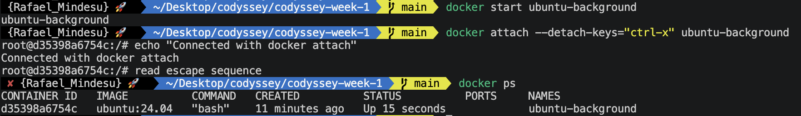

`docker attach`는 컨테이너 내부에 새로운 프로세스를 생성하는 것이 아니라, 현재 실행 중인 메인 프로세스의 표준 입력과 출력에 직접 연결합니다.

### 7.9 `docker attach`에서 `exit` 실행 결과

`docker attach`로 연결된 상태에서 `exit`를 입력했습니다.

```bash
exit
```

이후 컨테이너 상태를 확인했습니다.

```bash
docker ps
```

```text
CONTAINER ID   IMAGE   COMMAND   CREATED   STATUS   PORTS   NAMES
```

실행 중인 컨테이너 목록이 비어 있는 것을 확인했습니다.

`ubuntu-background` 컨테이너의 메인 프로세스는 `bash`였습니다. `docker attach`는 이 메인 Bash에 직접 연결하므로, `exit`를 입력하자 메인 프로세스가 종료되었고 컨테이너도 함께 종료되었습니다.

종료된 컨테이너를 포함한 전체 목록은 다음 명령으로 확인했습니다.

```bash
docker ps -a --filter "name=ubuntu-background"
```

### 7.10 컨테이너를 종료하지 않고 `attach` 연결 해제

Docker의 기본 연결 해제 키는 다음과 같습니다.

```text
Control + P
Control + Q
```

하지만 VSCode 통합 터미널에서는 해당 키 조합이 단축키와 충돌하거나 입력이 제대로 전달되지 않을 수 있습니다.

따라서 `--detach-keys` 옵션을 사용해 연결 해제 키를 `Control + X`로 변경했습니다.

먼저 종료된 컨테이너를 다시 시작했습니다.

```bash
docker start ubuntu-background
```

사용자 지정 연결 해제 키를 지정하여 컨테이너에 연결했습니다.

```bash
docker attach \
  --detach-keys="ctrl-x" \
  ubuntu-background
```

컨테이너 내부에서 다음 명령을 실행했습니다.

```bash
echo "Connected with custom detach key"
```

이후 `Control + X`를 눌러 컨테이너를 종료하지 않고 연결만 해제했습니다.

macOS 터미널에서 컨테이너 상태를 확인했습니다.

```bash
docker ps
```

`ubuntu-background`가 계속 `Up` 상태로 표시되는 것을 통해 메인 프로세스를 종료하지 않고 연결만 해제된 것을 확인했습니다.

### 7.11 `docker exec`와 `docker attach` 비교

| 구분 | `docker exec` | `docker attach` |
|---|---|---|
| 연결 방식 | 컨테이너 내부에 새 프로세스 실행 | 실행 중인 메인 프로세스에 직접 연결 |
| Bash 실행 | 새로운 Bash 프로세스 생성 | 기존 메인 Bash 사용 |
| `exit` 실행 결과 | 추가 Bash만 종료 | 메인 Bash와 컨테이너가 함께 종료될 수 있음 |
| 컨테이너 유지 여부 | 일반적으로 유지됨 | 메인 프로세스 종료 시 컨테이너도 종료됨 |
| 주요 용도 | 컨테이너 내부 점검 및 명령 실행 | 메인 프로세스의 입출력 확인 |

실행 중인 컨테이너 내부를 점검하거나 명령을 실행할 때는 메인 프로세스에 영향을 주지 않는 `docker exec`가 더 안전하다는 점을 확인했습니다.

## 8. Ubuntu 컨테이너 트러블슈팅

### 8.1 동일한 컨테이너 이름 사용으로 인한 충돌

#### 문제

다음 명령으로 `ubuntu-background` 컨테이너를 생성하려고 했습니다.

```bash
docker run -dit \
  --name ubuntu-background \
  ubuntu:24.04 \
  bash
```

하지만 다음 오류가 발생했습니다.

```text
Conflict. The container name "/ubuntu-background" is already in use.
You have to remove (or rename) that container to be able to reuse that name.
```

#### 원인 가설

이전에 생성했던 `ubuntu-background` 컨테이너가 종료되었거나 실행 중인 상태로 남아 있어 동일한 이름을 다시 사용할 수 없는 것으로 판단했습니다.

#### 확인

종료된 컨테이너를 포함하여 해당 이름을 사용하는 컨테이너를 확인했습니다.

```bash
docker ps -a --filter "name=ubuntu-background"
```

기존 `ubuntu-background` 컨테이너가 존재하는 것을 확인했습니다.

#### 해결

기존 컨테이너를 계속 사용하기 위해 다음 명령으로 다시 시작했습니다.

```bash
docker start ubuntu-background
```

컨테이너 내부 접속은 `docker exec`를 이용했습니다.

```bash
docker exec -it ubuntu-background bash
```

기존 컨테이너가 필요하지 않은 경우에는 다음 명령으로 삭제한 뒤 같은 이름을 다시 사용할 수 있습니다.

```bash
docker rm -f ubuntu-background
```

#### 결과

기존 컨테이너를 정상적으로 다시 실행하고 내부에 접속할 수 있었습니다.

Docker에서는 실행 상태와 관계없이 존재하는 컨테이너의 이름을 중복해서 사용할 수 없다는 점을 확인했습니다.

### 8.2 `docker attach`에서 `exit` 후 컨테이너 종료

#### 문제

`docker attach`로 접속한 뒤 `exit`를 입력하자 `ubuntu-background` 컨테이너가 실행 중인 목록에서 사라졌습니다.

```bash
docker attach ubuntu-background
```

```bash
exit
```

```bash
docker ps
```

#### 원인 가설

`docker attach`가 컨테이너 내부에 새로운 Bash를 실행하는 것이 아니라, 컨테이너의 메인 Bash 프로세스에 직접 연결하기 때문이라고 판단했습니다.

#### 확인

종료된 컨테이너를 포함한 전체 목록을 확인했습니다.

```bash
docker ps -a --filter "name=ubuntu-background"
```

`ubuntu-background` 컨테이너가 `Exited` 상태인 것을 확인했습니다.

#### 해결

컨테이너를 다시 실행했습니다.

```bash
docker start ubuntu-background
```

VSCode 통합 터미널에서 기본 연결 해제 키가 원활하게 동작하지 않을 수 있어 사용자 지정 연결 해제 키를 사용했습니다.

```bash
docker attach \
  --detach-keys="ctrl-x" \
  ubuntu-background
```

컨테이너 내부에서 `exit`를 입력하지 않고 `Control + X`를 눌러 연결만 해제했습니다.

#### 결과

다시 `docker ps`를 실행했을 때 `ubuntu-background` 컨테이너가 계속 `Up` 상태를 유지했습니다.

이번 실습을 통해 `docker attach`에서 `exit`를 입력하는 것과 연결만 해제하는 것은 서로 다른 동작임을 확인했습니다.

## 9. Dockerfile 기반 커스텀 웹 서버 제작

기존 NGINX 이미지를 기반으로 정적 웹 페이지를 추가한 커스텀 Docker 이미지를 제작했습니다.

Dockerfile을 직접 작성한 뒤 이미지를 빌드하고, 컨테이너를 실행하여 터미널과 브라우저에서 웹 페이지에 정상적으로 접속할 수 있는지 검증했습니다.

### 9.1 구현 방식

과제에서 제시한 커스텀 이미지 제작 방식 중 다음 방식을 선택했습니다.

```text
(A) 웹 서버 베이스 이미지 활용 + 정적 콘텐츠 교체
```

베이스 이미지로 `nginx:alpine`을 사용했습니다.

`nginx:alpine`은 NGINX 웹 서버가 포함되어 있으며, Alpine Linux 기반으로 이미지 크기가 비교적 작다는 특징이 있습니다.

이번 실습에서는 NGINX 자체 설정을 변경하기보다 기본 정적 파일 경로에 직접 작성한 `index.html`을 복사하는 방식으로 웹 서버를 구성했습니다.

### 9.2 웹 페이지 작성

웹 서버에서 제공할 정적 페이지를 `app/index.html`에 작성했습니다.

```bash
mkdir -p app

cat <<'EOF' > app/index.html
<!DOCTYPE html>
<html lang="ko">
<head>
    <meta charset="UTF-8">
    <meta
        name="viewport"
        content="width=device-width, initial-scale=1.0"
    >
    <title>Codyssey Week 1</title>
    <style>
        body {
            display: flex;
            justify-content: center;
            align-items: center;
            min-height: 100vh;
            margin: 0;
            font-family: Arial, sans-serif;
            background-color: #f4f6f8;
        }

        main {
            padding: 40px;
            text-align: center;
            background-color: white;
            border-radius: 12px;
            box-shadow: 0 4px 16px rgba(0, 0, 0, 0.1);
        }
    </style>
</head>
<body>
    <main>
        <h1>Development Workstation</h1>
        <p>Dockerfile로 실행한 NGINX 웹 서버입니다.</p>
        <p>Codyssey Week 1</p>
    </main>
</body>
</html>
EOF
```

작성한 파일의 내용은 다음 명령으로 확인했습니다.

```bash
cat app/index.html
```

### 9.3 Dockerfile 작성

프로젝트 루트에 다음 Dockerfile을 작성했습니다.

```dockerfile
FROM nginx:alpine

LABEL org.opencontainers.image.title="codyssey-week-1"
LABEL org.opencontainers.image.description="NGINX web server for Docker practice"

COPY app/ /usr/share/nginx/html/

EXPOSE 80
```

각 명령의 역할은 다음과 같습니다.

| 명령 | 역할 |
|---|---|
| `FROM nginx:alpine` | NGINX가 설치된 기존 이미지를 베이스 이미지로 사용 |
| `LABEL` | 이미지의 이름과 설명 같은 메타데이터 기록 |
| `COPY app/ ...` | 호스트의 정적 웹 파일을 NGINX 기본 문서 경로로 복사 |
| `EXPOSE 80` | 컨테이너가 80번 포트를 사용한다는 정보를 명시 |

이번 이미지에 적용한 커스텀 포인트는 다음과 같습니다.

- 기본 NGINX 페이지를 직접 작성한 웹 페이지로 교체했습니다.
- 이미지의 목적을 확인할 수 있도록 `LABEL`을 추가했습니다.
- 정적 파일만 포함하여 동일한 페이지를 반복해서 실행할 수 있도록 구성했습니다.

### 9.4 `.dockerignore` 작성

Docker 이미지 빌드에 필요하지 않은 파일이 빌드 컨텍스트에 포함되지 않도록 `.dockerignore`를 작성했습니다.

```text
.git
.gitignore
.DS_Store
README.md
images
permission-practice
terminal-practice
```

`.dockerignore`를 사용하면 불필요한 파일이 Docker 데몬에 전달되는 것을 줄이고, 민감하거나 용량이 큰 파일이 실수로 이미지에 포함되는 것을 방지할 수 있습니다.

### 9.5 프로젝트 구조 확인

웹 서버 관련 파일을 추가한 뒤 프로젝트 구조를 확인했습니다.

```bash
tree -a -L 3 -I '.git|.DS_Store'
```

웹 서버와 관련된 주요 구조는 다음과 같습니다.

```text
.
├── .dockerignore
├── Dockerfile
├── README.md
├── app
│   └── index.html
└── images
    └── web-server-practice
```

### 9.6 커스텀 이미지 빌드

프로젝트 루트를 Docker 빌드 컨텍스트로 사용하여 커스텀 이미지를 생성했습니다.

```bash
docker build -t codyssey-web:1.0 .
```

이미지 이름은 `codyssey-web`, 태그는 `1.0`으로 지정했습니다.

빌드된 이미지는 다음 명령으로 확인했습니다.

```bash
docker images codyssey-web
```

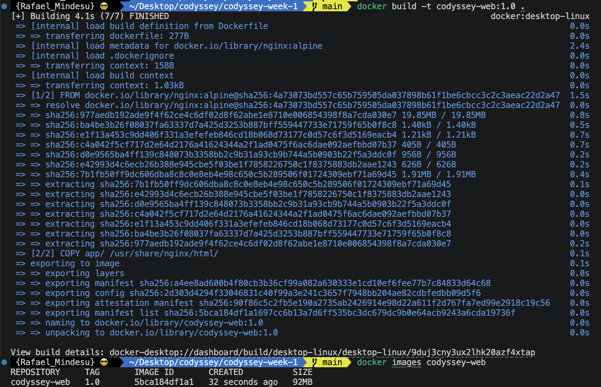

`docker images` 목록에서 `codyssey-web:1.0` 이미지가 생성된 것을 확인했습니다.

### 9.7 웹 서버 컨테이너 실행

빌드한 이미지를 사용하여 `codyssey-web` 컨테이너를 백그라운드에서 실행했습니다.

```bash
docker run -d \
  --name codyssey-web \
  -p 8080:80 \
  codyssey-web:1.0
```

실행 중인 컨테이너는 다음 명령으로 확인했습니다.

```bash
docker ps
```

```text
0.0.0.0:8080->80/tcp
```

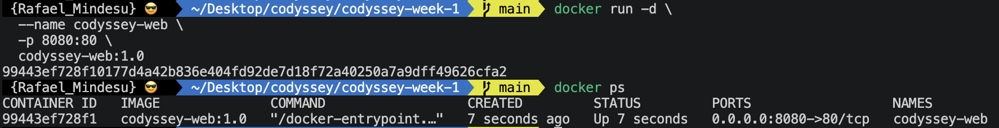

`STATUS`가 `Up`으로 표시되고, `PORTS` 항목에 `8080->80`이 출력되는 것을 확인했습니다.

### 9.8 컨테이너 로그 확인

NGINX 컨테이너의 실행 로그를 확인했습니다.

```bash
docker logs codyssey-web
```

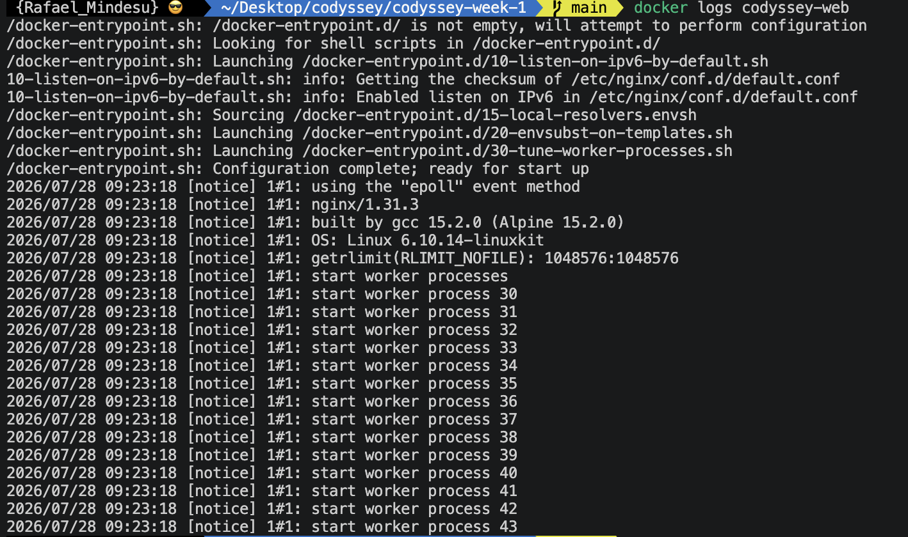

NGINX 초기화 과정과 웹 서버 실행 로그가 출력되는 것을 통해 컨테이너가 정상적으로 시작되었음을 확인했습니다.

### 9.9 터미널에서 웹 서버 응답 확인

`curl` 명령으로 호스트의 8080번 포트에 요청을 보냈습니다.

```bash
curl http://localhost:8080
```

응답으로 직접 작성한 `index.html` 내용이 출력되는 것을 확인했습니다.

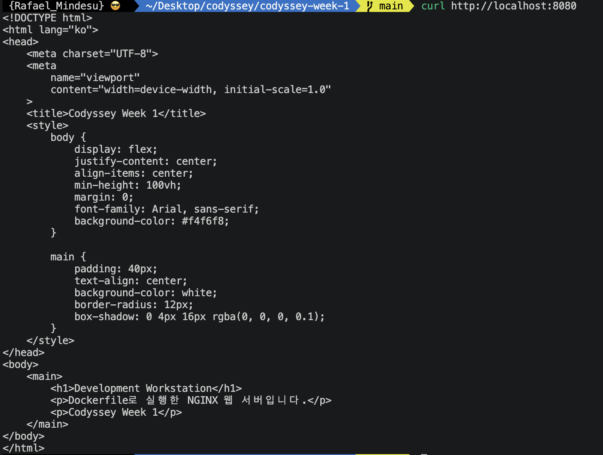

HTTP 응답 상태는 다음 명령으로 추가 확인했습니다.

```bash
curl -I http://localhost:8080
```

```text
HTTP/1.1 200 OK
```

`200 OK`는 웹 서버가 요청을 정상적으로 처리했다는 의미입니다.

### 9.10 브라우저 접속 확인

브라우저 주소창에 다음 주소를 입력했습니다.

```text
http://localhost:8080
```

주소창의 포트 번호와 직접 작성한 웹 페이지가 함께 표시되는 것을 확인했습니다.

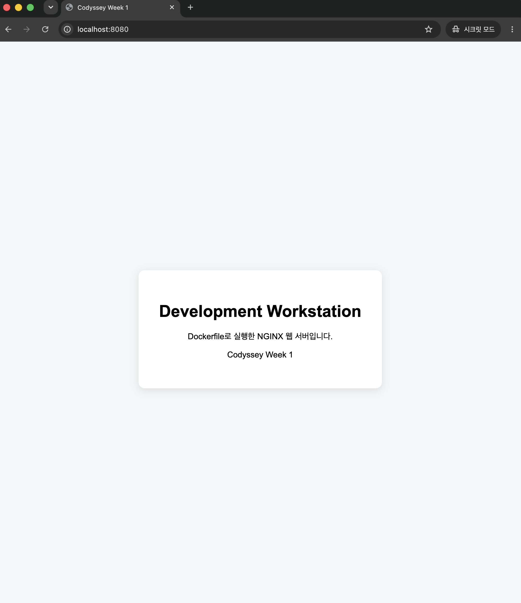

이를 통해 호스트의 8080번 포트로 들어온 요청이 Docker 컨테이너 내부의 NGINX 80번 포트로 정상적으로 전달되는 것을 확인했습니다.

### 9.11 포트 매핑이 필요한 이유

컨테이너는 호스트와 분리된 네트워크 환경에서 실행됩니다.

따라서 컨테이너 내부에서 NGINX가 80번 포트를 사용하고 있더라도, 별도의 포트 매핑 없이 호스트의 브라우저에서 직접 접근할 수 없습니다.

이번 실습에서는 다음 옵션을 사용했습니다.

```text
-p 8080:80
```

각 포트의 의미는 다음과 같습니다.

| 구분 | 포트 | 의미 |
|---|---:|---|
| 호스트 포트 | `8080` | MacBook에서 브라우저나 `curl`로 접근하는 포트 |
| 컨테이너 포트 | `80` | NGINX가 컨테이너 내부에서 요청을 받는 포트 |

요청 흐름은 다음과 같습니다.

```text
브라우저 또는 curl
        ↓
MacBook의 localhost:8080
        ↓
Docker 포트 매핑
        ↓
NGINX 컨테이너의 80번 포트
```

포트 매핑을 통해 격리된 컨테이너의 서비스를 호스트 외부에 노출할 수 있습니다.

### 9.12 Docker 운영 명령 확인

실행 중인 웹 서버를 대상으로 이미지, 컨테이너, 로그 및 리소스 상태를 확인했습니다.

```bash
docker images
docker ps
docker ps -a
docker logs codyssey-web
docker stats --no-stream codyssey-web
```

`docker stats --no-stream` 명령으로 웹 서버 컨테이너의 CPU, 메모리, 네트워크 및 디스크 사용량을 한 번만 출력하여 확인했습니다.

### 9.13 커스텀 이미지와 컨테이너의 관계

이번 실습에서 작성한 Dockerfile은 커스텀 이미지를 생성하기 위한 설계 파일입니다.

```text
Dockerfile
    ↓ docker build
codyssey-web:1.0 이미지
    ↓ docker run
codyssey-web 컨테이너
```

Dockerfile이나 `app/index.html`을 수정하더라도 기존에 빌드된 이미지의 내용이 자동으로 변경되지는 않습니다.

변경 내용을 이미지에 반영하려면 다음 명령으로 다시 빌드해야 합니다.

```bash
docker build -t codyssey-web:1.0 .
```

이미지는 컨테이너를 생성하기 위한 읽기 전용 템플릿이고, 컨테이너는 해당 이미지를 기반으로 만들어진 실제 실행 환경입니다.

### 9.14 검증 결과

이번 실습을 통해 다음 내용을 확인했습니다.

- 기존 `nginx:alpine` 이미지를 기반으로 커스텀 이미지를 만들었습니다.
- Dockerfile에서 정적 웹 콘텐츠를 NGINX 경로에 복사했습니다.
- `docker build`로 `codyssey-web:1.0` 이미지 생성에 성공했습니다.
- `docker run`으로 웹 서버 컨테이너 실행에 성공했습니다.
- `-p 8080:80`으로 호스트와 컨테이너의 포트를 연결했습니다.
- `curl` 응답과 브라우저 화면에서 웹 페이지가 정상적으로 제공되는 것을 확인했습니다.
- Dockerfile을 이용하면 동일한 웹 서버 환경을 반복해서 재현할 수 있음을 확인했습니다.

## 10. 바인드 마운트 변경 반영 검증

호스트인 MacBook의 `app` 디렉토리를 NGINX 컨테이너 내부에 바인드 마운트한 뒤, 호스트 파일의 변경 사항이 이미지 재빌드나 컨테이너 재시작 없이 즉시 반영되는지 확인했습니다.

### 10.1 기존 웹 서버 컨테이너 정리

기존 `codyssey-web` 컨테이너가 호스트의 8080번 포트를 사용하고 있었기 때문에 바인드 마운트 실습 전에 해당 컨테이너를 삭제했습니다.

```bash
docker rm -f codyssey-web
```

삭제 여부는 다음 명령으로 확인했습니다.

```bash
docker ps -a --filter "name=codyssey-web"
```

컨테이너만 삭제했으며, 이전에 빌드한 `codyssey-web:1.0` 이미지는 그대로 유지했습니다.

### 10.2 바인드 마운트 컨테이너 실행

호스트의 `app` 디렉토리를 컨테이너 내부의 NGINX 정적 파일 경로에 연결했습니다.

```bash
docker run -d \
  --name bind-web \
  -p 8080:80 \
  --mount type=bind,source="$(pwd)/app",target=/usr/share/nginx/html,readonly \
  nginx:alpine
```

실행 옵션은 다음과 같습니다.

| 설정 | 의미 |
|---|---|
| `-d` | 컨테이너를 백그라운드에서 실행 |
| `--name bind-web` | 컨테이너 이름을 `bind-web`으로 지정 |
| `-p 8080:80` | 호스트의 8080번 포트를 컨테이너의 80번 포트에 연결 |
| `type=bind` | 바인드 마운트 방식 사용 |
| `source="$(pwd)/app"` | 호스트에서 연결할 `app` 디렉토리 |
| `target=/usr/share/nginx/html` | 컨테이너 내부 NGINX 정적 파일 경로 |
| `readonly` | 컨테이너에서 마운트된 파일을 수정하지 못하도록 제한 |

컨테이너 실행 상태를 확인했습니다.

```bash
docker ps
```

`bind-web` 컨테이너가 `Up` 상태로 표시되고 다음 포트 연결 정보를 확인했습니다.

```text
0.0.0.0:8080->80/tcp
```

### 10.3 바인드 마운트 정보 확인

`docker inspect` 명령으로 컨테이너에 적용된 마운트 정보를 확인했습니다.

```bash
docker inspect bind-web \
  --format '{{range .Mounts}}{{println "Type:" .Type}}{{println "Source:" .Source}}{{println "Destination:" .Destination}}{{println "ReadOnly:" (not .RW)}}{{end}}'
```

출력 결과는 다음과 같은 형태로 나타났습니다.

```text
Type: bind
Source: /Users/<username>/.../codyssey-week-1/app
Destination: /usr/share/nginx/html
ReadOnly: true
```

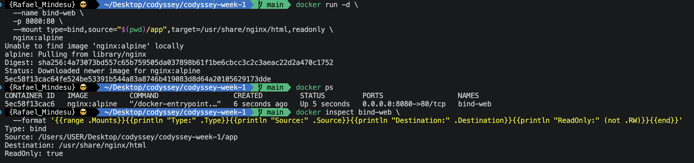

이를 통해 호스트의 `app` 디렉토리가 컨테이너 내부의 `/usr/share/nginx/html` 경로와 읽기 전용으로 연결된 것을 확인했습니다.

### 10.4 변경 전 웹 페이지 확인

호스트의 `app/index.html` 파일 내용을 확인했습니다.

```bash
cat app/index.html
```

터미널에서 웹 서버 응답을 확인했습니다.

```bash
curl http://localhost:8080
```

브라우저에서도 다음 주소로 접속했습니다.

```text
http://localhost:8080
```

변경 전에는 다음 문구가 표시되었습니다.

```text
Dockerfile로 실행한 NGINX 웹 서버입니다.
```

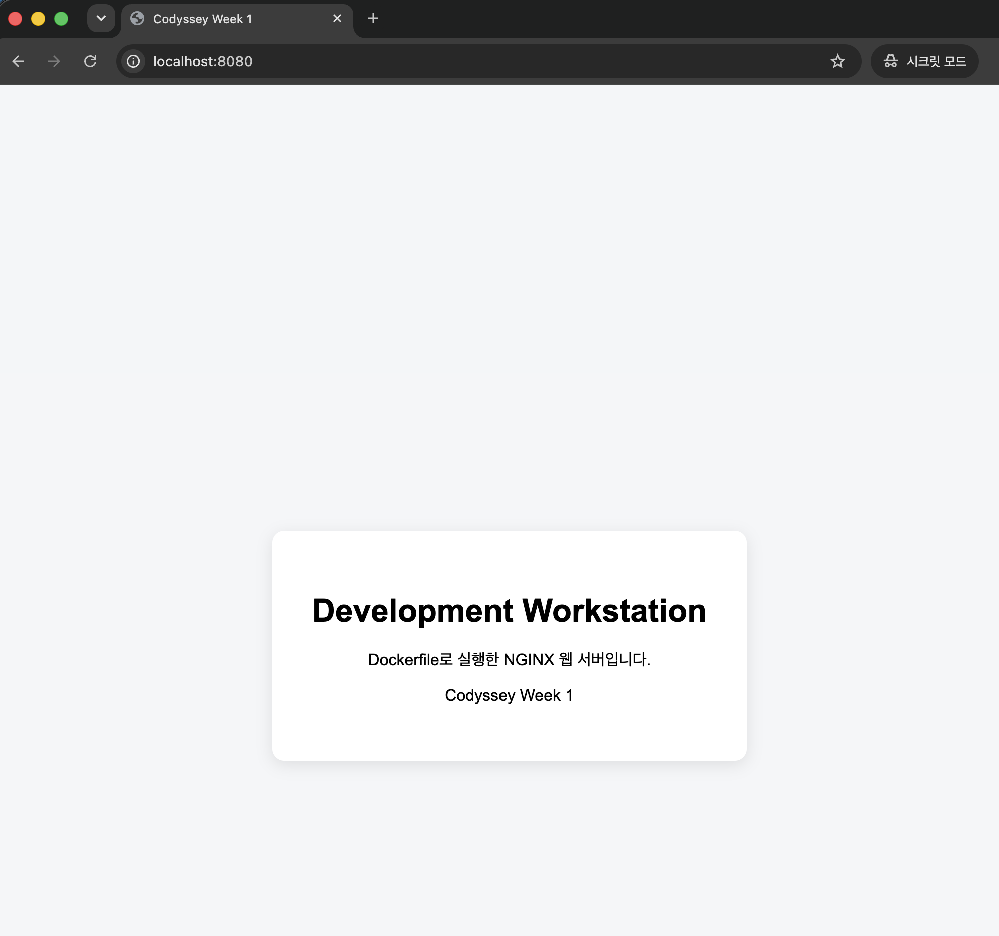

### 10.5 호스트 파일 변경

컨테이너를 중지하거나 이미지를 다시 빌드하지 않은 상태에서 호스트의 `app/index.html` 내용을 변경했습니다.

macOS의 `sed` 명령을 사용하여 기존 문구를 새로운 문구로 교체했습니다.

```bash
sed -i '' \
  's/Dockerfile로 실행한 NGINX 웹 서버입니다./바인드 마운트로 변경 사항이 반영되었습니다./' \
  app/index.html
```

변경 결과를 확인했습니다.

```bash
grep -n "바인드 마운트" app/index.html
```

```text
바인드 마운트로 변경 사항이 반영되었습니다.
```

macOS에서는 `sed` 명령으로 원본 파일을 직접 수정할 때 `-i ''` 형식을 사용합니다.

### 10.6 변경 사항 즉시 반영 확인

이미지를 다시 빌드하거나 컨테이너를 재시작하지 않고 웹 서버 응답을 다시 확인했습니다.

```bash
curl http://localhost:8080
```

브라우저에서 페이지를 새로고침했습니다.

```text
http://localhost:8080
```

변경 후에는 다음 문구가 표시되었습니다.

```text
바인드 마운트로 변경 사항이 반영되었습니다.
```

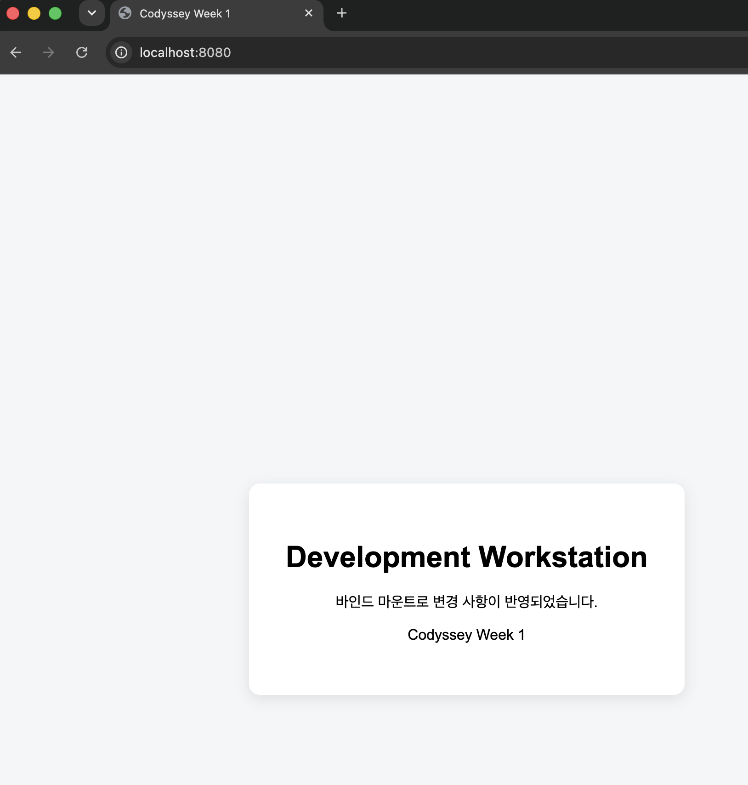

호스트의 파일을 수정하자 실행 중인 컨테이너의 웹 페이지에도 변경 내용이 즉시 반영되는 것을 확인했습니다.

### 10.7 컨테이너 내부 파일 확인

호스트에서 변경한 내용이 컨테이너 내부 파일에서도 확인되는지 검증했습니다.

```bash
docker exec bind-web \
  grep -n "바인드 마운트" /usr/share/nginx/html/index.html
```

호스트의 `app/index.html`에서 확인한 것과 동일한 문구가 출력되었습니다.

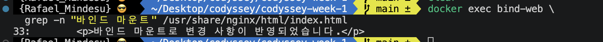

호스트 파일이 컨테이너 내부에 새로 복사된 것이 아니라, 두 경로가 직접 연결되어 있기 때문에 동일한 내용이 조회됩니다.

```text
MacBook의 app/index.html
              │
              │ 바인드 마운트
              ▼
컨테이너의 /usr/share/nginx/html/index.html
```

### 10.8 읽기 전용 마운트 확인

컨테이너 실행 시 `readonly` 옵션을 적용했기 때문에 컨테이너 내부에서 마운트된 파일을 수정할 수 없는지 확인했습니다.

```bash
docker exec bind-web \
  sh -c 'echo "container change" >> /usr/share/nginx/html/index.html'
```

다음과 같은 오류가 발생했습니다.

```text
Read-only file system
```

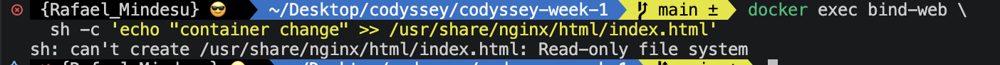

컨테이너는 호스트의 웹 파일을 읽을 수 있지만, 해당 파일을 수정할 수 없음을 확인했습니다.

읽기 전용 마운트를 사용하면 컨테이너 프로세스가 호스트의 소스코드를 실수로 변경하는 것을 방지할 수 있습니다.

### 10.9 Dockerfile의 `COPY`와 바인드 마운트 비교

Dockerfile의 `COPY` 방식과 바인드 마운트 방식은 다음과 같은 차이가 있습니다.

| 구분 | Dockerfile `COPY` | 바인드 마운트 |
|---|---|---|
| 파일 저장 위치 | 이미지 내부 | 호스트 파일 시스템 |
| 호스트 파일 변경 | 기존 이미지에 반영되지 않음 | 실행 중인 컨테이너에 즉시 반영 |
| 이미지 재빌드 | 필요 | 필요하지 않음 |
| 호스트 경로 의존성 | 비교적 낮음 | 호스트 경로에 의존 |
| 주요 용도 | 배포용 이미지 제작 | 로컬 개발 및 변경 확인 |

Dockerfile의 `COPY` 방식에서는 파일 변경 후 다음과 같이 이미지를 다시 빌드해야 합니다.

```bash
docker build -t codyssey-web:1.0 .
```

반면 바인드 마운트 방식에서는 호스트의 `app/index.html`을 수정하는 것만으로 실행 중인 웹 서버에 변경 사항이 반영되었습니다.

### 10.10 바인드 마운트가 필요한 이유

개발 과정에서 소스코드를 수정할 때마다 Docker 이미지를 다시 빌드하면 작업 시간이 증가합니다.

바인드 마운트를 사용하면 호스트의 개발 파일을 컨테이너에서 직접 참조할 수 있으므로 다음 흐름으로 작업할 수 있습니다.

```text
호스트에서 파일 수정
        ↓
바인드 마운트 경로에 즉시 반영
        ↓
컨테이너가 변경된 파일 사용
        ↓
브라우저 새로고침으로 결과 확인
```

따라서 바인드 마운트는 코드나 정적 파일을 자주 수정하는 로컬 개발 환경에 적합합니다.

### 10.11 운영 상태 확인

실행 중인 바인드 마운트 컨테이너의 상태와 로그, 리소스 사용량을 확인했습니다.

```bash
docker ps
docker logs bind-web
docker stats --no-stream bind-web
```

`docker logs`를 통해 NGINX의 요청 로그를 확인하고, `docker stats --no-stream`을 통해 CPU와 메모리 사용량을 확인했습니다.

### 10.12 검증 결과

이번 실습을 통해 다음 내용을 확인했습니다.

- 호스트 디렉토리를 컨테이너 내부 경로에 직접 연결할 수 있습니다.
- `docker inspect`로 바인드 마운트의 원본 경로와 대상 경로를 확인할 수 있습니다.
- 호스트 파일을 수정하면 이미지 재빌드 없이 실행 중인 컨테이너에 즉시 반영됩니다.
- 바인드 마운트는 호스트의 실제 파일을 컨테이너에서 직접 참조합니다.
- `readonly` 옵션으로 컨테이너의 파일 수정 권한을 제한할 수 있습니다.
- Dockerfile의 `COPY`는 배포용 이미지 제작에 적합합니다.
- 바인드 마운트는 로컬 개발 중 변경 사항을 빠르게 확인할 때 적합합니다.

## 11. Docker 볼륨 영속성 검증

Docker 볼륨을 생성해 Ubuntu 컨테이너의 `/data` 디렉토리에 연결하고, 컨테이너를 삭제한 뒤 새로운 컨테이너에 동일한 볼륨을 연결하여 기존 데이터가 유지되는지 확인했습니다.

### 11.1 Docker 볼륨 생성

`codyssey-data`라는 이름의 Docker 볼륨을 생성했습니다.

```bash
docker volume create codyssey-data
```

생성된 볼륨은 다음 명령으로 확인했습니다.

```bash
docker volume ls
```

```text
DRIVER    VOLUME NAME
local     codyssey-data
```

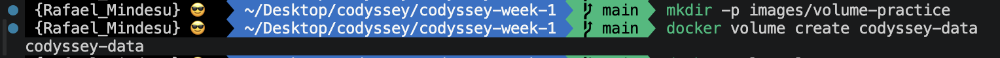

Docker 볼륨은 컨테이너의 파일 시스템과 분리되어 관리되는 영속 저장소입니다.

컨테이너가 삭제되더라도 볼륨을 별도로 삭제하지 않는 한 볼륨에 저장된 데이터는 유지됩니다.

### 11.2 Docker 볼륨 상세 정보 확인

`docker volume inspect` 명령으로 생성한 볼륨의 상세 정보를 확인했습니다.

```bash
docker volume inspect codyssey-data
```

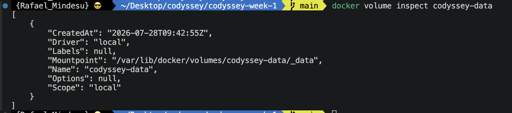

주요 확인 항목은 다음과 같습니다.

| 항목 | 의미 |
|---|---|
| `Name` | Docker 볼륨의 이름 |
| `Driver` | 볼륨을 관리하는 드라이버 |
| `Mountpoint` | Docker 환경 내부에서 볼륨 데이터가 저장되는 위치 |
| `Scope` | 볼륨이 사용되는 범위 |

Docker Desktop은 macOS 위의 Linux 가상 환경에서 Docker 엔진을 실행합니다. 따라서 `Mountpoint`에 표시된 경로는 일반적인 macOS 디렉토리 경로가 아니라 Docker가 관리하는 Linux 환경 내부의 경로입니다.

### 11.3 첫 번째 컨테이너에 볼륨 연결

생성한 `codyssey-data` 볼륨을 첫 번째 Ubuntu 컨테이너의 `/data` 경로에 연결했습니다.

```bash
docker run -d \
  --name volume-test-1 \
  --mount type=volume,source=codyssey-data,target=/data \
  ubuntu:24.04 \
  sleep infinity
```

각 설정의 의미는 다음과 같습니다.

| 설정 | 의미 |
|---|---|
| `-d` | 컨테이너를 백그라운드에서 실행 |
| `--name volume-test-1` | 첫 번째 컨테이너 이름 지정 |
| `type=volume` | Docker 볼륨 방식 사용 |
| `source=codyssey-data` | 연결할 Docker 볼륨 지정 |
| `target=/data` | 컨테이너 내부에서 볼륨을 연결할 경로 |
| `sleep infinity` | 컨테이너가 종료되지 않고 계속 실행되도록 유지 |

컨테이너 실행 상태는 다음 명령으로 확인했습니다.

```bash
docker ps
```

### 11.4 볼륨에 데이터 저장

첫 번째 컨테이너의 `/data` 디렉토리에 `message.txt` 파일을 생성했습니다.

```bash
docker exec volume-test-1 \
  bash -c 'echo "Persistent data from codyssey" > /data/message.txt'
```

파일 목록과 저장된 내용을 확인했습니다.

```bash
docker exec volume-test-1 ls -l /data
docker exec volume-test-1 cat /data/message.txt
```

```text
Persistent data from codyssey
```

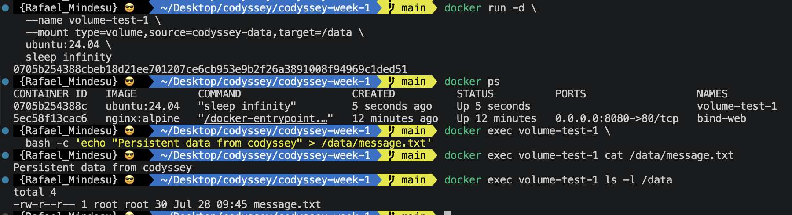

이를 통해 컨테이너 내부의 `/data/message.txt` 파일이 연결된 `codyssey-data` 볼륨에 저장된 것을 확인했습니다.

### 11.5 컨테이너의 볼륨 연결 정보 확인

`docker inspect` 명령으로 첫 번째 컨테이너에 적용된 볼륨 정보를 확인했습니다.

```bash
docker inspect volume-test-1 \
  --format '{{range .Mounts}}{{println "Type:" .Type}}{{println "Name:" .Name}}{{println "Destination:" .Destination}}{{println "RW:" .RW}}{{end}}'
```

출력 결과는 다음과 같은 형태로 나타났습니다.

```text
Type: volume
Name: codyssey-data
Destination: /data
RW: true
```

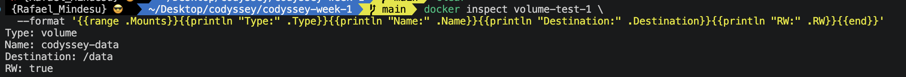

`RW: true`는 컨테이너가 연결된 볼륨에 데이터를 읽고 쓸 수 있다는 의미입니다.

### 11.6 첫 번째 컨테이너 삭제

데이터를 생성한 `volume-test-1` 컨테이너를 삭제했습니다.

```bash
docker rm -f volume-test-1
```

삭제 여부를 확인했습니다.

```bash
docker ps -a --filter "name=volume-test-1"
```

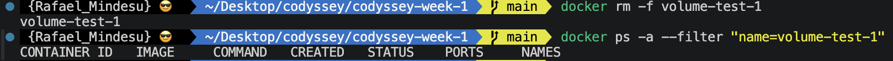

첫 번째 컨테이너를 삭제한 후에도 Docker 볼륨이 유지되는지 확인했습니다.

```bash
docker volume ls
```

목록에 `codyssey-data`가 계속 표시되는 것을 확인했습니다.

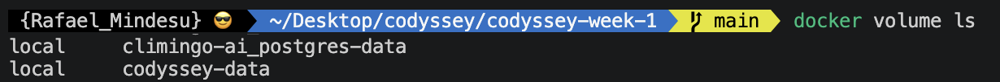

컨테이너와 Docker 볼륨은 서로 독립적으로 관리되기 때문에 컨테이너를 삭제해도 이름이 지정된 볼륨은 자동으로 삭제되지 않습니다.

### 11.7 두 번째 컨테이너에 동일한 볼륨 연결

새로운 `volume-test-2` 컨테이너를 실행하면서 기존 `codyssey-data` 볼륨을 동일한 `/data` 경로에 연결했습니다.

```bash
docker run -d \
  --name volume-test-2 \
  --mount type=volume,source=codyssey-data,target=/data \
  ubuntu:24.04 \
  sleep infinity
```

실행 상태를 확인했습니다.

```bash
docker ps
```

이 컨테이너는 첫 번째 컨테이너와 이름 및 파일 시스템이 다른 새로운 컨테이너이지만, 동일한 Docker 볼륨을 사용합니다.

### 11.8 컨테이너 삭제 후 데이터 유지 확인

두 번째 컨테이너에서 `/data` 디렉토리의 파일 목록을 확인했습니다.

```bash
docker exec volume-test-2 ls -l /data
```

첫 번째 컨테이너에서 생성한 파일의 내용을 확인했습니다.

```bash
docker exec volume-test-2 cat /data/message.txt
```

```text
Persistent data from codyssey
```

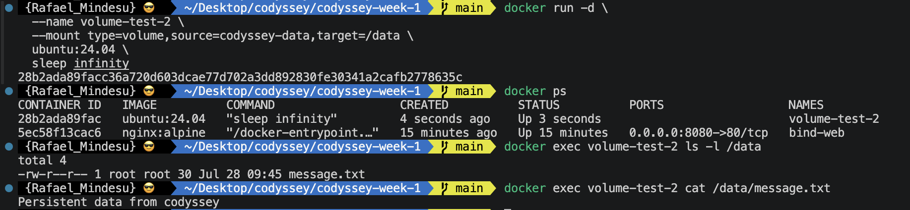

첫 번째 컨테이너를 삭제했음에도 새로운 컨테이너에서 기존 `message.txt` 파일을 조회할 수 있었습니다.

데이터 유지 과정은 다음과 같습니다.

```text
volume-test-1 컨테이너
        │
        │ message.txt 저장
        ▼
codyssey-data 볼륨
        │
        │ volume-test-1 삭제 후에도 유지
        ▼
volume-test-2 컨테이너
        │
        │ 동일한 볼륨 연결
        ▼
기존 message.txt 조회 성공
```

이를 통해 데이터가 컨테이너 자체의 파일 시스템이 아니라 별도로 연결한 Docker 볼륨에 저장되었다는 것을 확인했습니다.

### 11.9 컨테이너 파일 시스템과 Docker 볼륨 비교

| 구분 | 컨테이너 파일 시스템 | Docker 볼륨 |
|---|---|---|
| 저장 위치 | 개별 컨테이너 내부 | Docker가 관리하는 별도 저장소 |
| 컨테이너 삭제 시 | 함께 삭제될 수 있음 | 별도로 삭제하지 않으면 유지 |
| 다른 컨테이너 연결 | 직접 공유하기 어려움 | 동일한 볼륨을 여러 컨테이너에 연결 가능 |
| 주요 사용 목적 | 임시 실행 파일 | 데이터베이스, 업로드 파일 등 영속 데이터 |
| 관리 방식 | 컨테이너에 종속 | 컨테이너와 독립적으로 관리 |

컨테이너 내부에만 저장한 데이터는 컨테이너 삭제 시 함께 사라질 수 있습니다.

반면 Docker 볼륨을 사용하면 컨테이너의 생성 및 삭제 주기와 관계없이 데이터를 유지할 수 있습니다.

### 11.10 바인드 마운트와 Docker 볼륨 비교

| 구분 | 바인드 마운트 | Docker 볼륨 |
|---|---|---|
| 관리 주체 | 사용자가 호스트 경로를 직접 관리 | Docker가 저장 위치를 관리 |
| 연결 대상 | 호스트의 특정 파일 또는 디렉토리 | Docker가 생성한 독립적인 저장소 |
| 호스트 경로 의존성 | 높음 | 비교적 낮음 |
| 변경 내용 확인 | 호스트에서 직접 확인 가능 | 컨테이너나 Docker 명령으로 확인 |
| 주요 사용 목적 | 소스코드 변경 즉시 반영 | 영속 데이터 저장 |
| 활용 예시 | 개발 소스, 설정 파일 | 데이터베이스, 업로드 파일, 애플리케이션 데이터 |

바인드 마운트는 호스트의 소스코드를 컨테이너에서 직접 사용하는 개발 환경에 적합합니다.

Docker 볼륨은 호스트의 특정 경로에 직접 의존하지 않으면서 컨테이너 데이터를 영속적으로 저장해야 하는 상황에 적합합니다.

### 11.11 볼륨 관리 명령

Docker 볼륨은 다음 명령으로 관리할 수 있습니다.

```bash
# 볼륨 생성
docker volume create codyssey-data

# 볼륨 목록 확인
docker volume ls

# 볼륨 상세 정보 확인
docker volume inspect codyssey-data

# 볼륨 삭제
docker volume rm codyssey-data
```

볼륨을 삭제하면 저장된 데이터도 함께 삭제되므로, 필요한 데이터가 없는지 확인한 후 삭제해야 합니다.

실습 결과를 검증하는 동안에는 `volume-test-2` 컨테이너와 `codyssey-data` 볼륨을 유지했습니다.

최종 정리가 필요한 경우 다음 명령을 사용할 수 있습니다.

```bash
docker rm -f volume-test-2
docker volume rm codyssey-data
```

### 11.12 검증 결과

이번 실습을 통해 다음 내용을 확인했습니다.

- Docker 볼륨을 직접 생성하고 목록 및 상세 정보를 확인할 수 있습니다.
- Docker 볼륨을 컨테이너의 특정 경로에 연결할 수 있습니다.
- 볼륨에 저장한 데이터는 컨테이너의 파일 시스템과 분리되어 관리됩니다.
- 데이터를 생성한 컨테이너를 삭제해도 Docker 볼륨은 유지됩니다.
- 새로운 컨테이너에 동일한 볼륨을 연결하면 기존 데이터를 다시 조회할 수 있습니다.
- Docker 볼륨은 컨테이너의 생명주기와 독립적으로 영속 데이터를 관리할 때 사용합니다.
- 바인드 마운트는 개발 파일 공유에 적합하고, Docker 볼륨은 영속 데이터 저장에 적합합니다.

## 12. Git 설정 및 GitHub·VSCode 연동

Git 사용자 정보와 기본 브랜치 설정을 확인하고, 로컬 저장소가 GitHub 원격 저장소와 정상적으로 연결되어 있는지 검증했습니다.

또한 VSCode에서 프로젝트 저장소를 열고 Source Control 기능을 통해 Git 저장소가 정상적으로 인식되는 것을 확인했습니다.

### 12.1 Git 사용자 정보 및 기본 브랜치 확인

Git 커밋에 사용되는 사용자 이름과 이메일을 확인했습니다.

```bash
git config --global user.name
git config --global user.email
```

Git 저장소를 처음 생성할 때 사용할 기본 브랜치 설정도 확인했습니다.

```bash
git config --global init.defaultBranch
```

전체 Git 설정은 다음 명령으로 확인했습니다.

```bash
git config --list
```

Git 설정 결과를 공개하기 전에 토큰, 비밀번호, 인증 코드와 같은 민감정보가 포함되지 않았는지 확인했습니다.

### 12.2 현재 브랜치 및 작업 상태 확인

현재 사용 중인 브랜치를 확인했습니다.

```bash
git branch --show-current
```

```text
main
```

현재 작업 디렉토리와 스테이징 영역의 상태를 확인했습니다.

```bash
git status
```

`git status` 명령으로 다음 내용을 확인할 수 있습니다.

- 현재 브랜치
- 수정된 파일
- 새로 생성된 파일
- 스테이징된 파일
- 원격 저장소와의 동기화 상태

### 12.3 GitHub 원격 저장소 연결 확인

로컬 저장소에 등록된 GitHub 원격 저장소 정보를 확인했습니다.

```bash
git remote -v
```

다음과 같이 `origin` 원격 저장소가 표시되는 것을 확인했습니다.

```text
origin  https://github.com/minsukim9/codyssey-week-1.git (fetch)
origin  https://github.com/minsukim9/codyssey-week-1.git (push)
```

`fetch`는 원격 저장소의 변경 사항을 가져올 때 사용하는 주소이고, `push`는 로컬 커밋을 원격 저장소에 전송할 때 사용하는 주소입니다.

### 12.4 Git 및 VSCode 연동 증거

Git 설정, 현재 브랜치, 원격 저장소 연결 상태와 VSCode의 Source Control 화면을 함께 확인했습니다.

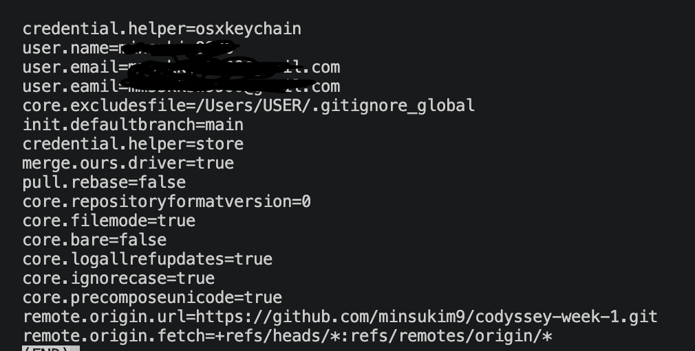

확인한 항목은 다음과 같습니다.

- Git 사용자 이름과 이메일 설정
- 기본 브랜치 `main` 설정
- 현재 브랜치 확인
- GitHub 원격 저장소 `origin` 연결
- VSCode의 Git 저장소 인식
- Source Control의 변경 파일 확인
- 로컬 저장소와 GitHub 저장소 연동

### 12.5 Git 커밋 및 Push

변경된 파일을 스테이징 영역에 추가했습니다.

```bash
git add .
```

스테이징 상태를 확인했습니다.

```bash
git status
```

변경 사항을 커밋했습니다.

```bash
git commit -m "docs: Git 연동 및 최종 실습 결과 정리"
```

로컬 커밋을 GitHub 원격 저장소에 반영했습니다.

```bash
git push origin main
```

Push 이후 작업 상태를 다시 확인했습니다.

```bash
git status
```

```text
nothing to commit, working tree clean
```

이를 통해 로컬 변경 사항이 모두 커밋되고 GitHub 원격 저장소에 반영된 것을 확인했습니다.

### 12.6 Git과 GitHub의 차이

| 구분 | Git | GitHub |
|---|---|---|
| 종류 | 분산 버전 관리 도구 | Git 저장소 호스팅 및 협업 플랫폼 |
| 실행 위치 | 로컬 컴퓨터 | 원격 서버 |
| 주요 역할 | 변경 이력, 브랜치, 커밋 관리 | 저장소 공유, 코드 리뷰, 협업 |
| 대표 작업 | `add`, `commit`, `branch` | `push`, `pull`, Pull Request |
| 인터넷 필요 여부 | 로컬 기능에는 필요하지 않음 | 원격 기능 사용 시 필요 |

Git은 로컬 컴퓨터에서 파일의 변경 이력을 관리합니다.

GitHub는 Git으로 관리하는 저장소를 원격에 보관하고 다른 사람과 공유하거나 협업할 수 있도록 지원합니다.

```text
파일 수정
   ↓
git add
   ↓
git commit
   ↓
로컬 Git 저장소
   ↓
git push
   ↓
GitHub 원격 저장소
```

### 12.7 보안 및 개인정보 확인

Git 설정과 VSCode 화면을 캡처하기 전에 다음 정보가 포함되지 않았는지 확인했습니다.

- GitHub 비밀번호
- Personal Access Token
- SSH 개인키
- 인증 코드
- Docker 또는 GitHub 인증 토큰
- 공개할 필요가 없는 개인정보

민감정보가 포함된 경우 해당 부분을 마스킹한 뒤 이미지를 저장했습니다.

### 12.8 검증 결과

이번 실습을 통해 다음 내용을 확인했습니다.

- Git 사용자 이름과 이메일 설정을 확인할 수 있습니다.
- Git의 기본 브랜치를 `main`으로 설정할 수 있습니다.
- `git status`로 작업 디렉토리 상태를 확인할 수 있습니다.
- `git remote -v`로 GitHub 원격 저장소 연결을 확인할 수 있습니다.
- 로컬 커밋을 `git push`로 GitHub에 전송할 수 있습니다.
- VSCode의 Source Control 기능과 터미널의 Git 명령은 동일한 저장소를 사용합니다.
- Git은 로컬 버전 관리 도구이고 GitHub는 원격 저장소 및 협업 플랫폼입니다.

## 13. 트러블슈팅

실습 과정에서 발생한 문제를 `문제 → 원인 가설 → 확인 → 해결 → 결과` 순서로 정리했습니다.

### 13.1 Docker 데몬 연결 실패

#### 문제

Docker 설치 후 다음 명령으로 실행 환경을 확인했습니다.

```bash
docker info
```

하지만 Docker Server 정보가 출력되지 않고 다음 오류가 발생했습니다.

```text
Cannot connect to the Docker daemon at unix:///Users/<username>/.docker/run/docker.sock.
Is the docker daemon running?
```

`docker --version` 명령은 정상적으로 실행되었지만 컨테이너를 실행할 수 없는 상태였습니다.

#### 원인 가설

Docker 명령어를 제공하는 Docker CLI는 설치되어 있지만, 실제 이미지와 컨테이너를 관리하는 Docker 엔진이 실행되지 않은 것으로 판단했습니다.

#### 확인

현재 Docker Context를 확인했습니다.

```bash
docker context ls
```

```text
NAME              DESCRIPTION                               DOCKER ENDPOINT
default           Current DOCKER_HOST based configuration
desktop-linux *   Docker Desktop
```

현재 Context는 `desktop-linux`로 설정되어 있었지만 Docker Desktop 애플리케이션이 실행되지 않은 상태였습니다.

#### 해결

Docker Desktop을 실행하고 Docker 엔진이 완전히 시작될 때까지 기다렸습니다.

이후 다음 명령을 다시 실행했습니다.

```bash
docker info
```

#### 결과

Docker Client 정보와 함께 Docker Server 정보가 정상적으로 출력되었습니다.

이번 문제를 통해 Docker CLI 설치 여부와 Docker 엔진 실행 여부는 서로 다른 상태라는 것을 확인했습니다.

---

### 13.2 동일한 컨테이너 이름 사용으로 인한 충돌

#### 문제

다음 명령으로 `ubuntu-background` 컨테이너를 생성하려고 했습니다.

```bash
docker run -dit \
  --name ubuntu-background \
  ubuntu:24.04 \
  bash
```

하지만 다음 오류가 발생했습니다.

```text
Conflict. The container name "/ubuntu-background" is already in use.
You have to remove (or rename) that container to be able to reuse that name.
```

#### 원인 가설

이전에 생성한 `ubuntu-background` 컨테이너가 종료되었더라도 삭제되지 않고 남아 있어 같은 이름을 다시 사용할 수 없는 것으로 판단했습니다.

#### 확인

종료된 컨테이너를 포함하여 해당 이름을 사용하는 컨테이너를 확인했습니다.

```bash
docker ps -a --filter "name=ubuntu-background"
```

기존 `ubuntu-background` 컨테이너가 목록에 존재하는 것을 확인했습니다.

#### 해결

기존 컨테이너를 계속 사용하기 위해 다음 명령으로 다시 시작했습니다.

```bash
docker start ubuntu-background
```

실행 중인 컨테이너 내부에는 다음 명령으로 접속했습니다.

```bash
docker exec -it ubuntu-background bash
```

기존 컨테이너가 필요하지 않은 경우에는 다음과 같이 삭제한 뒤 같은 이름으로 다시 생성할 수 있습니다.

```bash
docker rm -f ubuntu-background
```

#### 결과

기존 컨테이너를 정상적으로 다시 실행하고 내부에 접속할 수 있었습니다.

Docker에서는 컨테이너의 실행 여부와 관계없이 이미 존재하는 컨테이너의 이름을 중복해서 사용할 수 없다는 것을 확인했습니다.

---

### 13.3 `docker attach`에서 `exit` 실행 후 컨테이너 종료

#### 문제

실행 중인 Ubuntu 컨테이너에 다음 명령으로 연결했습니다.

```bash
docker attach ubuntu-background
```

연결된 상태에서 `exit`를 입력했습니다.

```bash
exit
```

이후 실행 중인 컨테이너를 확인했지만 `ubuntu-background`가 목록에서 사라졌습니다.

```bash
docker ps
```

#### 원인 가설

`docker attach`는 컨테이너 내부에 새로운 Bash 프로세스를 생성하는 것이 아니라, 컨테이너의 메인 프로세스에 직접 연결하기 때문이라고 판단했습니다.

`ubuntu-background` 컨테이너의 메인 프로세스는 Bash였으므로 `exit`를 입력하면 메인 Bash가 종료되고 컨테이너도 함께 종료될 수 있습니다.

#### 확인

종료된 컨테이너를 포함하여 상태를 확인했습니다.

```bash
docker ps -a --filter "name=ubuntu-background"
```

`ubuntu-background` 컨테이너가 `Exited` 상태로 표시되는 것을 확인했습니다.

#### 해결

종료된 컨테이너를 다시 시작했습니다.

```bash
docker start ubuntu-background
```

VSCode 통합 터미널에서는 Docker의 기본 연결 해제 키인 `Control + P`, `Control + Q`가 단축키와 충돌할 수 있어 사용자 지정 연결 해제 키를 적용했습니다.

```bash
docker attach \
  --detach-keys="ctrl-x" \
  ubuntu-background
```

컨테이너에 연결한 뒤 `exit`를 입력하지 않고 `Control + X`를 눌러 연결만 해제했습니다.

#### 결과

연결을 해제한 뒤 컨테이너 상태를 확인했습니다.

```bash
docker ps
```

`ubuntu-background` 컨테이너가 계속 `Up` 상태를 유지했습니다.

이번 실습을 통해 `docker attach` 상태에서 `exit`를 입력하는 것과 컨테이너를 종료하지 않고 연결만 해제하는 것은 서로 다른 동작임을 확인했습니다.

실행 중인 컨테이너 내부를 점검할 때는 메인 프로세스에 직접 연결하는 `docker attach`보다 별도의 프로세스를 실행하는 `docker exec`를 사용하는 것이 더 안전합니다.

---

### 13.4 읽기 전용 바인드 마운트 파일 수정 실패

#### 문제

바인드 마운트로 연결한 파일을 컨테이너 내부에서 수정하기 위해 다음 명령을 실행했습니다.

```bash
docker exec bind-web \
  sh -c 'echo "container change" >> /usr/share/nginx/html/index.html'
```

하지만 다음 오류가 발생했습니다.

```text
Read-only file system
```

#### 원인 가설

`bind-web` 컨테이너를 실행할 때 바인드 마운트에 `readonly` 옵션을 적용했기 때문에 컨테이너에서 해당 경로를 수정할 수 없는 것으로 판단했습니다.

```bash
docker run -d \
  --name bind-web \
  -p 8080:80 \
  --mount type=bind,source="$(pwd)/app",target=/usr/share/nginx/html,readonly \
  nginx:alpine
```

#### 확인

`docker inspect` 명령으로 컨테이너의 바인드 마운트 설정을 확인했습니다.

```bash
docker inspect bind-web \
  --format '{{range .Mounts}}{{println "Type:" .Type}}{{println "Destination:" .Destination}}{{println "ReadOnly:" (not .RW)}}{{end}}'
```

```text
Type: bind
Destination: /usr/share/nginx/html
ReadOnly: true
```

마운트 대상이 읽기 전용으로 연결되어 있음을 확인했습니다.

#### 해결 및 대안

이번 실습에서는 컨테이너가 호스트의 소스 파일을 변경하지 못하도록 제한하는 것이 목적이었으므로 `readonly` 설정을 그대로 유지했습니다.

컨테이너에서도 마운트된 파일을 수정해야 한다면 기존 컨테이너를 삭제하고 `readonly` 옵션 없이 다시 실행할 수 있습니다.

```bash
docker rm -f bind-web

docker run -d \
  --name bind-web \
  -p 8080:80 \
  --mount type=bind,source="$(pwd)/app",target=/usr/share/nginx/html \
  nginx:alpine
```

#### 결과

`Read-only file system` 오류는 Docker 실행 실패가 아니라, 설정한 읽기 전용 권한이 의도대로 동작한 결과라는 것을 확인했습니다.

읽기 전용 마운트를 사용하면 컨테이너 프로세스가 호스트의 소스코드를 실수로 변경하는 것을 방지할 수 있습니다.

### 13.5 호스트 포트 충돌로 인한 컨테이너 실행 실패

#### 문제

기존 `bind-web` 컨테이너가 호스트의 8080번 포트를 사용하고 있는 상태에서 새로운 NGINX 컨테이너에도 동일한 포트를 연결하려고 했습니다.

```bash
docker run -d \
  --name port-conflict-web \
  -p 8080:80 \
  nginx:alpine
```

컨테이너 실행 과정에서 다음과 같은 포트 충돌 오류가 발생했습니다.

```text
Bind for 0.0.0.0:8080 failed: port is already allocated
```

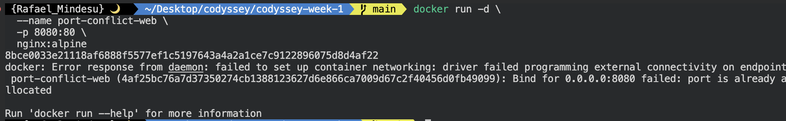

#### 원인 가설

Docker의 `-p 8080:80` 설정은 호스트의 8080번 포트를 컨테이너 내부의 80번 포트에 연결합니다.

하나의 호스트 포트는 같은 주소에서 여러 컨테이너가 동시에 사용할 수 없기 때문에, 기존 컨테이너가 8080번 포트를 점유하고 있는 것으로 판단했습니다.

#### 포트 사용 상태 확인

macOS에서 8080번 포트를 사용 중인 프로세스를 확인하기 위해 `lsof` 명령을 실행했습니다.

```bash
lsof -nP -iTCP:8080 -sTCP:LISTEN
```

```text
COMMAND     PID   USER   FD   TYPE   DEVICE   SIZE/OFF   NODE   NAME
com.docke  <PID>  ...   ...  IPv6   ...      ...        TCP    *:8080 (LISTEN)
```

각 옵션의 의미는 다음과 같습니다.

| 옵션 | 의미 |
|---|---|
| `-n` | 호스트 이름 변환 생략 |
| `-P` | 포트 번호를 서비스 이름으로 변환하지 않음 |
| `-iTCP:8080` | TCP 8080번 포트를 사용하는 프로세스 조회 |
| `-sTCP:LISTEN` | 연결 요청을 기다리는 프로세스만 조회 |

Docker Desktop 환경에서는 호스트 포트를 중계하는 Docker 관련 프로세스가 출력될 수 있습니다.

#### 프로세스 및 컨테이너 확인

`lsof`에서 확인한 PID의 프로세스 정보를 조회했습니다.

```bash
ps -p <PID> -o pid,ppid,user,command
```

Docker 컨테이너 중 8080번 포트를 공개하고 있는 컨테이너도 확인했습니다.

```bash
docker ps --filter "publish=8080"
```

```text
CONTAINER ID   IMAGE          PORTS                  NAMES
<container-id> nginx:alpine   0.0.0.0:8080->80/tcp   bind-web
```

`docker port` 명령으로 `bind-web`의 포트 연결 정보를 추가로 확인했습니다.

```bash
docker port bind-web
```

```text
80/tcp -> 0.0.0.0:8080
```

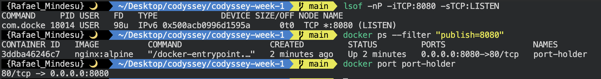

이를 통해 `bind-web` 컨테이너가 이미 호스트의 8080번 포트를 사용하고 있어 새로운 컨테이너가 같은 포트를 사용할 수 없다는 것을 확인했습니다.

#### 해결

포트 충돌로 정상 실행되지 않은 컨테이너를 삭제했습니다.

```bash
docker rm -f port-conflict-web
```

기존 `bind-web` 컨테이너의 8080번 포트는 그대로 유지하고, 새로운 컨테이너에는 사용하지 않는 8081번 호스트 포트를 할당했습니다.

```bash
docker run -d \
  --name port-change-web \
  -p 8081:80 \
  nginx:alpine
```

실행 중인 컨테이너의 포트 연결을 확인했습니다.

```bash
docker ps --filter "name=port-change-web"
```

```text
0.0.0.0:8081->80/tcp
```

8081번 포트가 연결 대기 상태인지 확인했습니다.

```bash
lsof -nP -iTCP:8081 -sTCP:LISTEN
```

웹 서버의 HTTP 응답도 확인했습니다.

```bash
curl -I http://localhost:8081
```

```text
HTTP/1.1 200 OK
```

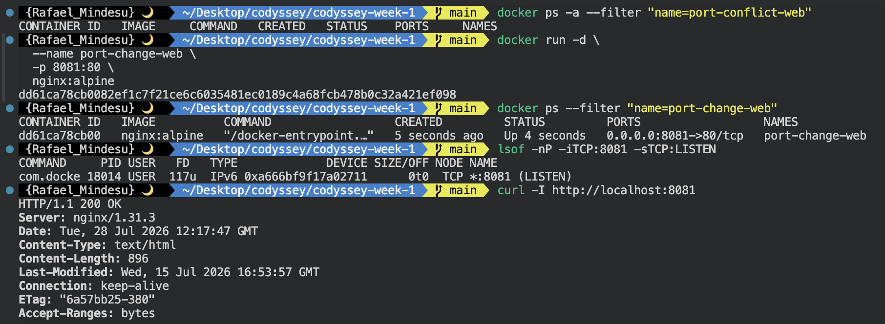

#### 결과

호스트 포트를 8080번에서 8081번으로 변경한 뒤 새로운 NGINX 컨테이너가 정상적으로 실행되었습니다.

이번 문제를 통해 포트 충돌이 발생하면 다음 순서로 진단할 수 있음을 확인했습니다.

```text
컨테이너 실행 오류 확인
        ↓
lsof로 호스트 포트 사용 여부 확인
        ↓
ps로 PID의 프로세스 확인
        ↓
docker ps와 docker port로 점유 컨테이너 확인
        ↓
기존 프로세스 종료 또는 호스트 포트 변경
        ↓
curl로 변경된 포트의 응답 확인
```

컨테이너 내부의 NGINX 포트는 계속 80번을 사용하지만, 호스트 포트는 실행 환경에 맞게 8081번 등 다른 포트로 변경할 수 있습니다.

### 13.6 트러블슈팅 결과

이번 트러블슈팅을 통해 다음 내용을 확인했습니다.

- Docker CLI가 설치되어 있어도 Docker 엔진이 실행되지 않으면 컨테이너를 사용할 수 없습니다.
- 종료된 컨테이너도 삭제되지 않았다면 동일한 이름을 다시 사용할 수 없습니다.
- `docker attach`는 컨테이너의 메인 프로세스에 직접 연결합니다.
- `docker attach` 상태에서 메인 프로세스를 종료하면 컨테이너도 함께 종료될 수 있습니다.
- 실행 중인 컨테이너 점검에는 `docker exec`가 비교적 안전합니다.
- 바인드 마운트의 `readonly` 옵션은 컨테이너에서 호스트 파일을 수정하지 못하도록 제한합니다.
- 오류 메시지와 컨테이너 상태를 함께 확인하면 문제의 원인을 구체적으로 파악할 수 있습니다.